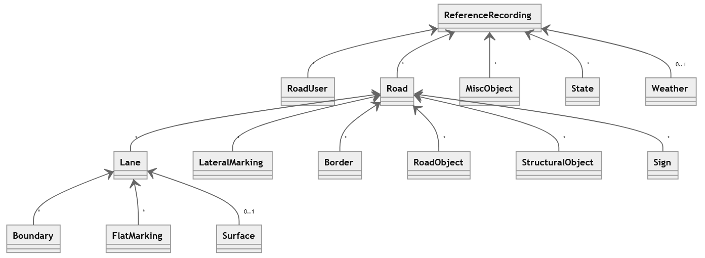
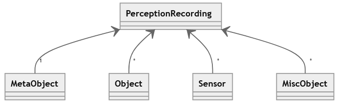
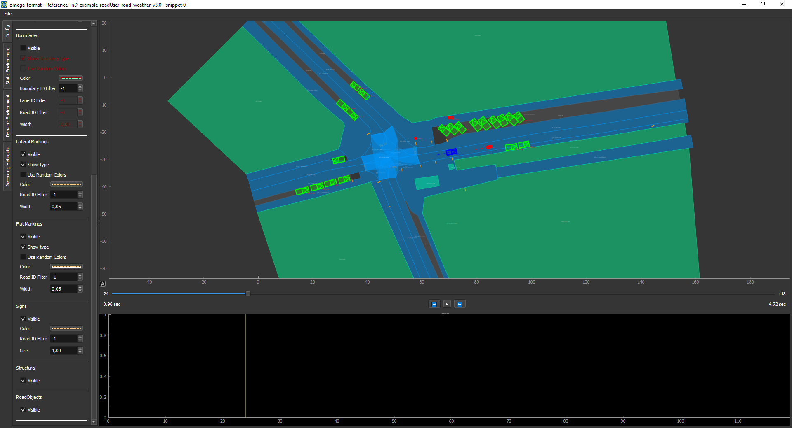

#  OMEGA Format - Python Library
This module is developed by [ika - RWTH Aachen](https://www.ika.rwth-aachen.de/de/) as a contribution to the [VVM](https://www.vvm-projekt.de/projekt) project which aims to develop test procedures and to provide frameworks and methods for the safety verification of automated vehicles. VVM is working on the use case of Urban Intersections and focuses on driving functions up to full automation of vehicles (SAE Level 4 and 5).

As part of the project a data format for storing reference and perception data from pilotings, test drives and simulation in urban traffic is developed. This module enables the creation, and visualization of data conforming to this data format. Additionally, it can check files for conformance and perform basic sanity checks on the data.


# Data Format
The base of both, the reference data format and the perception data format is the [HDF5](https://www.hdfgroup.org/solutions/hdf5) file format. This library utilizes [h5py](https://www.h5py.org/) to interact with those.

## Reference Data
The `OMEGA Format reference recording` format is used to store data that represents the 'true' state of road users, infrastructure information, weather and more during a piloting, testing or simulation. The representation is on an object list basis.
The following diagram shows an overview of the hierarchy in the `OMEGA Format reference recording` format. A more detailed description can be found in the [specification document](./doc/specification.md) and the [signal list](./doc/signal_list_reference.md).



## Perception Data
The `PerceptionRecording` format is used to store data that represents what a vehicle under test, sensor under test or similar perceives from its surroundings. It is designed to be compared against the `ReferenceRecording` format. The following diagram shows an overview of the hierarchy in the `PerceptionRecording` format. A more detailed description is coming soon.



# Installation
The dependencies are managed with [conda environments](https://docs.conda.io/projects/conda/en/latest/user-guide/concepts/environments.html). Conda can be installed following the [conda installation instructions](https://docs.conda.io/en/latest/miniconda.html).

To create a new conda environment `omega_env` and install the module run the following in your console:
```bash
conda env create -n omega_env -f environment_visualization.yml
conda activate omega_env
```
If you want an editable install (modifications to the files in the directory are immediately used by the module) run:
```
pip install -e .[visualization]
```

To update the existing environment upon addition of new dependencies:
```bash
conda env update -n omega_env -f environment_visualization.yml
```

# Usage

## Validate your data
To check if your file conforms to the specification run.
```bash
omega_format verify --reference <FILENAME>
```
or 
```bash 
omega_format verify --perception <FILENAME>
```

When using the library and creating objects or rading from an hdf5 file, by default, sanity checks are performed. To circumvent those pass `validate=False` to the `from_hdf5` function or use or use `cls.model_construct` instead of `cls` as the constructor of an object. In the backend [pydantic](https://pydantic-docs.helpmanual.io/) is used for the sanity checks.
## Visualize your data
To visualize a data file execute the following in your conda environment:
```bash
omega_format visualize --snip --max-snippets=2 <FILENAME>
```
or in Python:
```python
import omega_format
from omega_format.visualization import Visualizer, SnippetContainer
reference_recording = omega_format.ReferenceRecording.from_hdf5('path/to/the/reference_recording_file.hdf5')
visualizer = Visualizer(SnippetContainer.create_list(references=reference_recording))
visualizer.start_gui_and_visualization()
```
A window will open that lets you interact with and inspect your data.


## Load data in older versions

```python
# load an omega-format file of an older version (e.g. `v3.1`)
rr = omega_format.ReferenceRecording.from_hdf5('path/to/v3.1_reference_recording.hdf5', legacy='v3.1')

rr.to_hdf5('path/where/to/store/current_version_reference_recording.hdf5')
```


### Extending the visualizer
By subclassing [`omega_format.visualization.VisualizationModule`](./omega_format/visualization/modules/base.py) and adding an instance of your subclass to the `visualizers` list of the [`Visualizer` ](./omega_format/visualization/visualizer.py) you can extend the functionality of the visualizer. The subclass has to implement at least one of the functions `visualize_static` and `visualize_dynamics`, returning a list of pyqt widgets to plot. For more details take a look at the [`omega_format.vis.VisualizationModule`](./omega_format/visualization/modules/base.py) or the other modules defined in the `visualization.modules` directory.

## Create a reference data object
This module maps the reference and perception data file specifications to a hierarchy of python classes. The root classes are `ReferenceRecording` and `PerceptionRecording` respectively. First initializing an object from that class and fill its properties with the objects of the classes in question (e.g. `Weather` `RoadUser`, `Lane`). After adding all your data, call `to_hdf5` on the `ReferenceRecording` or `PerceptionRecording` and a format compliant `hdf5` file will be created for you.
```python
import numpy as np
import omega_format
from datetime import datetime

rr = omega_format.ReferenceRecording(meta_data=omega_format.MetaData(recorder_number=1,
                                                                     recording_number=1,
                                                                     daytime=datetime.now(),
                                                                     reference_point_lat=50.786687,
                                                                     reference_point_lon=6.046312),
                               timestamps=omega_format.Timestamps(val=np.array([0])),
                               )
rr.weather = omega_format.Weather()
rr.road_users[0] = omega_format.RoadUser(type=omega_format.ReferenceTypes.RoadUser.Type.CAR, sub_type=omega_format.ReferenceTypes.RoadUser.SubType.General.REGULAR,
                                    birth=0, bb=omega_format.BoundingBox(np.array([2,3,0])),
                                    tr=omega_format.Trajectory(pos_x=np.array([0]),pos_y=np.array([0]),pos_z=np.array([0]),
                                                          roll=np.array([0]),pitch=np.array([0]),heading=np.array([0])))
rr.roads[0] = omega_format.Road(location=omega_format.ReferenceTypes.RoadLocation.URBAN)
rr.to_hdf5('test.hdf5')
```
# Further Help
## Standalone viewer of hdf5 files

There are plenty of tools, e.g.
- [silx](http://www.silx.org/doc/silx/latest/install.html) (also available on "Ubuntu Software")
- [ViTables](https://vitables.org/)


## Documentation
 You can create a documentation with [pdoc3](https://pdoc3.github.io/pdoc/). To do this first install `pdoc3` with `pip install pdoc3` and then run `pdoc3 --http localhost:8889 --template-dir .\doc\templates\ .\omega_format` from the root of this repo to view the documentation in your web browser.
# License
The library is published under the MIT license specified in [LICENSE](./LICENSE). An overview over the licenses of the dependencies in this library is listed in [LICENSES_OF_REQUIREMENTS.md](./LICENSES_OF_REQUIREMENTS.md).

# Contact
In case of questions regarding the format, this repository or otherwise related feel free to raise an issue or contact Michael Schuldes (michael.schuldes@ika.rwth-aachen.de).

# Acknowledgement
The research leading to these results is funded by the German Federal Ministry for Economic Affairs and Energy within the project “Verifikations- und Validierungsmethoden automatisierter Fahrzesuge im urbanen Umfeld". The authors would like to thank the consortium for the successful cooperation. 

<a href='https://www.bmwi.de/Navigation/EN/Home/home.html'></a>
