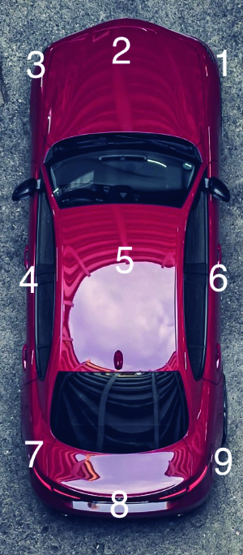

+---------------------------------------------------------+
| DOKUMENTATION                                           |
+---------------------------------------------------------+
|                                                         |
+---------------------------------------------------------+
| **Specification Input Data Format Perception Database** |
+---------------------------------------------------------+
|                                                         |
+---------------------------------------------------------+
| Art: Dokumentation/Bericht                              |
|                                                         |
| Ersteller: Maike Scholtes (ika)                         |
+---------------------------------------------------------+
|                                                         |
+---------------------------------------------------------+
| Version 1.3                                             |
+---------------------------------------------------------+
|                                                         |
+---------------------------------------------------------+
| Datum: 01.09.2021                                       |
+---------------------------------------------------------+

# Table of Contents 

[1. Introduction and Information on this Document
5](#introduction-and-information-on-this-document)

[2. General Information](#general-information)

[2.1 Sensor Coordinate System](#sensor-coordinate-system)

[2.2 Ego Coordinate System](#ego-coordinate-system)

[2.3 Reference Point](#reference-point)

[2.4 Timestamps and Data Rate](#timestamps-and-data-rate)

[2.5 Type](#type)

[2.6 Compulsory Fields and non compulsory fields
7](#compulsory-fields-and-non-compulsory-fields)

[2.7 Variances](#variances)

[3. Top Level](#top-level)

[3.1 formatVersion](#formatversion)

[3.2 RecorderNumber](#recordernumber)

[3.3 RecordingNumber](#recordingnumber)

[3.4 converterVersion](#converterversion)

[3.5 EgoID](#egoid)

[3.6 EgoOffset](#egooffset)

[3.7 CustomInformation](#custominformation)

[4. Timestamps](#timestamps)

[5. Object](#object)

[5.1 Meta Information (Attributes)](#meta-information-attributes)

[5.2 ID](#id)

[5.3 birthStamp](#birthstamp)

[5.4 Object/id...](#objectid)

[5.4.1 Object Classification](#object-classification)

[5.4.2 Confidence (of object classification)
11](#confidence-of-object-classification)

[5.4.3 heading](#heading)

[5.4.4 Movement Classification ](#movement-classification)

[5.4.5 Confidence of Existence](#confidence-of-existence)

[5.4.6 MeasState](#measstate)

[5.4.7 RCS (val/valType)](#rcs-valvaltype)

[5.4.8 Tracking Point](#tracking-point)

[6. Sensor](#sensor)

[6.1 Sensor Modality](#sensor-modality)

[6.2 fusionInformation](#fusioninformation)

[6.3 FirmwareVersion](#firmwareversion)

[6.4 OriginalUpdateRate](#originalupdaterate)

[6.5 SensorPos](#sensorpos)

[6.6 Sensor Orientation](#sensor-orientation)

[6.7 Range](#range)

[6.8 VelocityRange](#velocityrange)

[6.9 Field of View](#field-of-view)

[6.10 Resolution](#resolution)

[6.11 Accuracy](#accuracy)

[6.12 Precision](#precision)

[6.13 Track Timing Information](#track-timing-information)

[7. Sensor Datasheet](#sensor-datasheet)

[8. egoPosition](#egoposition)

[9. Additional Sensors](#additional-sensors)

## Versions

| Name           | Datum      | Version | Kurzbeschreibung    |
|:---------------|:-----------|:--------|:--------------------|
| Maike Scholtes | 25.06.2020 | V0.1    | Initial Document    |
| Maike Scholtes | 05.11.2020 | V1.1    | Changing for some   signal names, introcuction of   more groups and subgroups |
| Maike Scholtes | 18.03.2021 | V1.2    | Major updates   Restructuring of metainformation   Introduction of attributes   Error corrections   |
| Maike Scholtes | 02.08.2021 | V1.2    | Update of documentation\   Additional information on   coordinate systems   |
| Maike Scholtes | 18.08.2021 | V1.3    | Version update,  see change log          |

# Introduction and Information on this Document

This document goes hand in hand with the excel document that provides
the signal list for the Perception Database input format. All
information can be found on Confluence:
[link](https://confluence.vdali.de/x/b4B-/).

This document will explain signals that are not self-explanatory (i.e.
not all signals of the excel list are mentioned here). Furthermore, it
will provide lookup tables wherever this is necessary to gain a uniform
format.

# General Information

Similar to the scenario input format the data format chosen is **hdf5**.
The format is structured into different parts. It starts with some
general information on the recording scenario itself. The main
information that is stored in this format is information gathered by
different sensors on detected objects (however, only on sensor modality
per file). Within VVM these sensors will include radar, camera and
lidar. The format works on object list basis, i.e. using data that
already went through a perception algorithm and did undergo detection
and tracking processes. Therefore, the format can also be used for fused
object information from different sensor sources. The group 'object'
contains the actual information on the different detected objects.
Another main part consist out of a detailed description of information
on the specific sensors used ('sensor'). Some of this information can be
gathered from the sensor data sheets, some might not be known due to the

In general, the information provided in the perception database format
is linked to the information provided in the scenario database. The
scenario database functions as the ground truth reference data.

In case of the AVL test vehicle, the ground truth, which is stored in
the scenario database, is gathered from the sensors of the vehicle's top
box and the labelling process the data undergoes. The data for the
perception database (i.e. the data stored in the format described in
this document) is gathered from the so called sensors under test (SeUT)
or perception under test (PeUT) that are installed around the vehicle.

While the PeUT, as described above, can consist of data from different
sensor modalities (e.g. object list of lidar and object list of radar
sensor), one separate file is needed for the different modalities. For
instance, if one recording was made providing reference data, radar data
and lidar data, the reference data would be saved in the scenario input
format. The lidar and radar object data would be saved in two individual
files using the perception format. I.e., the whole setup would produce
three different files that can be uploaded in the individual data bases.
In case the perception data is gained from a fusion algorithm, this data
will be put into one perception file. The sensor group (see Section 6),
however, could contain information on every single sensor used in the
fusion.

Leave fields empty if you do not have the information. Do not put in
zeros as those can be mistaken for "real zeros".

## Sensor Coordinate System

The sensor coordinate system is a coordinate system that has its origin
in the point of installation of the sensor on the vehicle. It will not
be used for the signals provided in the format. However, if a value is
desired in the sensor coordinate system, it can be calculated by the use
of the desired signals and the mounting position of the sensor in the
vehicle coordinate system (see Section 2.2) provided in the Sensor
information (see Chapter 6). The sensor coordinate system is identical
to the vehicle coordinate system (DIN ISO 8855) with the
x-axis/longitudinal pointing in the viewing direction of the sensor, the
y-axis/lateral pointing to the left and z-axis pointing upwards, just
moved to a different origin (sensor mounting position). The heading
angle is defined in the mathematical positive sense of rotation and
given in degrees between 0 and 360 deg. It is zero when looking in the
direction of the x-axis.

## Ego Coordinate System

The ego coordinate system is a standard vehicle coordinate system (DIN
ISO 8855). It has its origin on the rear axis, laterally in the center
of the vehicle and on the ground. The ego vehicle is the vehicle
recording the perception data. It is used for the object data in this
format. The heading is defined in mathematical positive sense of
rotation and given in degrees between 0 and 360 deg. It is zero when
looking in the direction of the x-axis.

Please note the difference between the coordinate system used in the
scenario database format and the perception database format. In the
scenario database format an UTM based coordinate system is used with
heading angle zero in eastern direction. In the perception database the
ego coordinate system, which is a vehicle coordinate system, is used.
Figure 1 shows the ego coordinate system used in the perception database
along with a detected sensor object (green) as well as the coordinate
system used for the scenario database (black axis labelled UTM).

Figure 1 - Different coordinate systems of perception and scenario
format

## Reference Point

All target objects described in the ‚Object' part of this input format
are described in their center and in the ego coordinate system. This
means that all measured data gathered by the different sensors must be
adapted so that the point provided is the center of the detected vehicle
in the ego vehicle coordinate system.

## Timestamps and Data Rate

The format uses, similarly to the scenario database input format, a
common timestamp vector. This means that all signals provided in the
perception database input format are synchronized with a common
timestamp. Furthermore, since the scenario database and the perception
database are coupled, the data rate, i.e., timestamp used in the
perception database needs to be equivalent with the one in the scenario
database input format. Precisely this means that when using the AVL test
vehicle and providing the ground truth with 10 Hz the sensor data also
needs to be provided with 10 Hz. For other data suppliers the usual
frame rate is 25 Hz. This also means that the timestamp vector in the
perception database format and the scenario database format are
equivalent in step size and entries. However, the perception timestamps
vector might start later than the scenario timestamps vector or only
contains a subset of the scenario timestamps vector, since the
perception recording might start at a different point in time.

## Type

The type field is provided for nearly every field in the object
category. It needs to be used in order to provide information on whether
the signal provided is actually measured by the sensor or if the
information has been calculated through other given information.
Furthermore, in this field it can be noted down if the information is
not provided at all (please note section 2.6 for more information on
compulsory and non compulsory fields). Considering the use case of the
perception database the original output of a sensor should always be
used if available.

The lookup table used for all signals of the type 'type' is as follows:

-   Not provided = 0

-   Measured = 1

-   Determined = 2

## Compulsory Fields and non compulsory fields

All sensors should at least provide:

-   Distances in longitudinal and lateral direction (z only if given)

-   Velocities in longitudinal and lateral direction (absolute and
    relative)

-   Acceleration in longitudinal and lateral direction (absolute and
    relative)

In general, the same format is used for every sensor no matter which
type or model. The format always has the same signals. They do not
change. Therefore, it contains signals that cannot be provided by some
sensor modalities. If a sensor does not provide a signal, this is noted
down in the type field of that value (compare section 2.5). The field
for the actual value can contain any number if it is set to not provided
through the type field. However, using an empty field is advisable.

Regarding the sensor information, any information that you have on the
specification of your sensor / your perception algorithm is useful.
Please try to gather as much information as possible. Under any
circumstances needed is information on the field of view. I.e., the
minimum information you need to provide is the range and the horizontal
opening angle.

## Variances

Variances can be noted down for most signals that are potentially
measured by the sensor and provided as output through the sensor. If the
sensor provides a variance for a signal, the value can be put in the
variance field for that signal. If it does not provide the variance or
the variance is determined through measured values, but not measured
itself, this can be noted down in the 'typeVarXXX' field for each
signal.

# Top Level

## formatVersion

Version number of the input format used. Please provide number in the
following format: "x.y"

In order to connect the scenario file (DGT) and the perception data
information on the filename of the GT for which the perception data is
recorded needs to be provided. The unique filename consists out of a
recorderNumber and a recordingNumber.

## RecorderNumber

Partner numbers/identifiers are generated on request. For now we are
certain that AVL and ika will deliver data. Therefore, those two are
already assigned a number below

-   1: AVL

-   2: ika

## RecordingNumber

The numbers of the individual recordings can be chosen by the partner
providing the data. It is important that those numbers are unique and
that the ground truth recording and the corresponding sensor under test
recording from the same drive get the same number.

## converterVersion

Since with the new findings in the project regarding the perception data
the entity recording the data is not necessarily the one converting the
data, the converter number should not only indicate with which version
of a converter the data is converted, but also indicate which entity did
the conversion.

Version number of the converter used in the format version „x.y". Along
with the hdf5 data a short documentation on the converter used to
convert the data into the format needs to be provided. The documentation
should show which methods and algorithms were used to generate the data
on the basis of which original data.

For now there are two entities known converting data. Those are already
assigned numbers below:

-   1: Valeo

-   2: ika

    This means the full converter number would look like the following
    in case valeo is converting:

    1-x.y

    Or like this if ika converted the data:

    2-x.y

## EgoID

The egoID is also used to couple the scenario and the perception
database. The ground truth contains information on every actor within a
scenario. For the evaluation it is important to know which of these
actors is the vehicle equipped with the perception sensors. The id of
this vehicle in the scenario database needs to be provided here.
Together with the coupling with the filename, the allocation is
unambiguous.

## EgoOffset

Offset between center point of ego vehicle and its rear axle in meters
measured in x direction of the vehicle coordinate system. Value is
needed to transform from the global coordinate system (reference) into
the vehicle coordinate system.

## CustomInformation

This field can be used, if necessary, if there is any information you
want to give the data analyst that does not fit into any of the provided
fields. The information can be provided here in writing. An example for
such an use case form real life is: The sensor you used did not provide
a tracking for some reason. In order to use this format, however, you
need tracking since the objects are provided in individual folders
labelled by their id. Therefore, you have implemented your own post
processing tracking. You could note this in the customInformation field
so that the data analyst knows that this tracking is not one originally
provided by the sensors algorithms.

# Timestamps

Similar to the scenario database input format, the format at hand has
one consistent timestamp vector. All signals that are time dependent
(such as distance, velocity, acceleration etc.) are provided in vectors
where the value in the vector at a certain position corresponds to the
timestamp at the same position in the timestamp vector.

The timestamp vector of the perception database input format is
equivalent to the timestamp vector in the scenario database input format
of one particular recording, since the two measurements are synched and
feature the same data rate.

# Object

The object type contains general information that should be given by
each sensor or is calculable by the given information and more specific
fields that can only be filled depending on the sensor type. Objects are
the objects of the object lists provided by the sensors (after
detection, clustering, tracking etc.).

The object group contains all meta information described in the
following section on the top level. Furthermore, all time dependent
information as well as the birthStamp of each object is structured in
individual groups labelled with the object id.

The structure is as follows:

-   Object

-   Metainformation (distLongitudinalValType, distLongitudinalVarType
    ... etc.)

-   0

    -   birthStamp

    -   distLongitudinal

        -   val

        -   var

    -   distLateral

        -   val

        -   var

    -   ...

-   1

    -   ...

-   2

    -   ...

-   ...

## Meta Information (Attributes)

This group contains all meta information through attributes in the hdf5
file. This meta information includes information on whether individual
data fields are calculated or measured directly by the sensor. The
information is contained in fields labeled in the following fashion:
informationXValType and informationXVarType. The fields labeled with
ValType refer to the actual value. Is it calculated or measured or not
provided at all. The field with the label VarType refer in the same way
to the variance fields. For instance, "distLongitudinalValType" contains
the information if the distance in longitudinal direction (in ego
coordinate system) is measured or calculated through other values. In
the same way "distLongitudinalVarType" contains this information for the
variance.

The lookup list how to indicate not provided, calculated, measured etc.
can be found in Section 2.5.

This meta information is given once as attributes in the top level of
the group object. It is the same for all detected objects.

## ID

Each object has one id. This id stays the same as long as the object is
tracked. The id is given indirectly through the position of the object
in the file.

## birthStamp

Comparable to the scenario description format, each object has a
birthStamp. This indicates at which point in the time stamp vector the
object appeared. I.e. if the birthStamp is 10, the object exists from
the point in time noted down at position 10 in the timestamps vector.

## Object/id...

The time dependent values per object (blue color in signal list, all
following entries of section 5) are contained in a group labelled with
the id of that specific object. For instance,
*object/0/distLongitudinal/val* for the longitudinal distance of object
with the id 0 etc.

Not all fields of the signal list are discussed in the following. The
ones that are unique such as distance and velocity are left out.

### Object Classification

Different sensors can provide different classifications for the detected
objects. The used terms and the ability of the sensor can differ. The
list below provides different vehicle types as well as some not as
precise information. The information given by the sensor needs to be
matched to the terms presented in the lookup table below:

-   NO_INFO = 0

-   CAR = 1

-   TRUCK = 2

-   MOTORCYCLE = 3

-   PEDESTRIAN = 4

-   BICYCLE = 5

-   UNKNOWN = 15

-   UNKNOWN_BIG = 14

-   UNKNOWN_SMALL = 13

-   SMALLER_THAN_CAR = 12

-   BIGGER_THAN_CAR = 11

### Confidence (of object classification)

Provide the object classification confidence in case the sensor outputs
this information (e.g. Ibeo Scalar). The higher the number, the larger
the certainty. Note in the objectClassificationConfidenceValType field
if this information is not provided.

### heading

Some sensors are able to provide the heading angle of the target. If
this is the case, it can be noted down here. If not, please make this
clear by providing a '0' in the valTypeHeading field. Same can be done
for the variance of the target heading if not provided. Note that the
heading is given in the ego coordinate system.

### Movement Classification

Some sensors provide a classification of the movement of the target.
E.g. this can describe if the object is stationary or crossing etc. A
list as a look up table to provide the correct integer in the input
format is provided below:

-   0 = no information

-   1 = unknown

-   2 = moving

-   3 = stationary

-   4 = oncoming

-   5 = crossingMoving

-   6 = crossingStationary

-   7 = stopped

Note that no information should be used if the sensor does not give this
information (you could also provide a '0' in the
movementClassificationValType field) and unknown if the sensor in theory
provides this information, but does not have it in this particular case.
One could also choose to enrich this information afterwards through the
distance and velocity information measured by the sensor. If this is
done this absolutely needs to be marked in the
movementClassificationValType field by providing a '2'.

### Confidence of Existence

Some sensor provide the probability by which they believe the detected
object does exist (or is a false positive). The probability can be given
in percent.

If the sensor provides the probability separated into several groups,
but no exact percentage, this can be transformed into a percentage. E.g.
a sensor provides a '1' if the probability of existence is \< 25%. If
this is the case use a 25 in the input format.

Please note that this is the probability of existence, if the sensor
provides the probability for a false detection, this needs to be
transformed correspondingly.

If the probability is not given at all this is noted in
confidenceOfExistenceValType.

### MeasState

The measurement state is provided by some sensors as a result of the
tracking process. It, e.g. describes if an object is newly detected, if
the current state is calculated through an old state, because no current
measurement is available and so on. The lookup table for the different
states is provided below:

-   Unknown/not given = 0

-   Deleted = 1

-   New Object = 2

-   Measured (Object has been confirmed by measurements) = 3

-   Predicted (Object state could not be confirmed by measurements and
    was predicted) = 4

-   Deleted from merge (Object was deleted as it was merged with another
    object) = 5

-   New from merge (New object created after a merge) = 6

If this information is not provided by the sensor this can be noted in
the measStateValType field through a '0'.

### RCS (val/valType)

In case the sensor is a radar sensor, some provide the radar cross
section (rcs) along with the object. Please note that the sensors
usually provide the cross section combined with the dB value, rather
than just square meters.

### Tracking Point

Lidar sensors can provide which tracking point (feature) of an object
has been detected. This can be imagined as a 3x3 grid on top of the
vehicle, i.e. describing all four corners, the centers of the edges and
the center of the vehicle. Even though the object data described in
[Chapter Object](#object) uses the
center of the vehicle as a reference point, for certain evaluations it
can become important to know from which feature the lidar sensor has
calculated this information. The different points in the grid can be
referenced by integer values found in the following lookup table:

Source: https://unsplash.com/photos/YU9rbNLQxSY

-   0 = unknown

-   1 = front right corner

-   2 = center of front edg

-   3 = front left corner

-   4 = center of left edge

-   5 = center of vehicle

-   6 = center of right edge

-   7 = rear left corner

-   8 = center of rear edge

-   9 = rear right corner

Note that 'unknown' should only be used if the sensor in theory has the
possibility to perform feature detection, but did not provide the
information for one or more timestamps. If the sensor is not able to
provide this information at all, this can be noted down by using a '0'
in the field 'trackingPointValType'.

# Sensor

The sensor type contains additional information on the sensor used. The
information provided should be as detailed as possible to enable a
meaningful analysis. **If an information is not known provide empty
field in case of strings and '999.0' for all other unknown fields**.
**Information that contributes to the field of view (range and at least
horizontal angle) is compulsory as well as the sensors mounting position
information**. Without this information an meaningful analysis would be
impossible.

All information is saved as metadata (attributes in hdf5). The
information is saved as follows:\
*sensor/id/...*\
Each sensor used for the perception file is contained and identifiable
through its id. I.e., the sensor group can contain a list of different
sensors. This can be necessary if the perception data is gathered by a
sensor featuring different modi for long range, short range etc. or has
different properties for the front and rear direction. Theoretically
this is also possible in case of a sensor fusion. One could provide all
sensors used for the fusion. However, since the fusion algorithm usually
has individual specifications regarding resolution etc., it might be
wise to provide the complete fusion perception as one "sensor" even
though it technically is not one physical sensor. In case you decide to
do so, you can use the field fusionInformation to note down the involved
sensor modalities of the fusion as a list.

Please note that you need to provide separate files of perception data
for the different sensor modalities. I.e. there will be one perception
file for the camera data and one separate for the radar data recorded
during the reference recording X.

If the actual sensor recording and the perception information differ,
e.g. when using an offline perception algorithm, provide the information
for the perception algorithm. Always provide the specifications for the
data that is contained in the file.

## Sensor Modality

-   Lidar: 1

-   Camera: 2

-   Radar_SR: 3

-   Radar_MR: 4

-   Radar_LR: 5

-   Fusion: 6

## fusionInformation

In case the sensor modality is a fusion, it can be wise to note down the
sensor modalities that were used for the fusion. E.g. a fusion of radar
and camera data. This can be done using this signal. Just provide the
involved sensor modalities as strings, e.g. "radar camera". If no fusion
is used this field can be left blanc.

## FirmwareVersion

The number of the firmware running on the sensor used.

## OriginalUpdateRate

The original update rate the sensor comes with. E.g. 40Hz or 10Hz. The
analyst then knows if the data has been up or down sampled to 10Hz / 25
Hz.

## SensorPos

The sensor position within the vehicle coordinate system is provided
through three values: sensorPosLongitudinal, sensorPosLateral and
sensorPosZ. Those values describe the mounting position of the sensor
and are necessary in order to transform data from the vehicle coordinate
system into the sensor coordinate system. sensorPosLongitudinal contains
the value along the x-axis of the vehicle coordinate system,
sensorPosLateral the value along the y-axis and sensorPosZ along the
z-axis.

## Sensor Orientation

Orientation of sensor in vehicle coordinate system. Please note that the
torsion of the sensor is given in the vehicle coordinate system that is
not rotated itself. Therefore, the order of applying the different
angles does not matter. However, it is important to first apply the
shift of origin given in SensorPos and then proceed with the torsion.
Angles are given in degree.

## Range

Min and max range describe the minimum and maximum range in with the
sensor can detect objects.

## VelocityRange

Min and may value of velocity the sensor can detect.

## Field of View

The field of view can be provided in terms of opening angles
horizontally and vertically. The horizontal field of view should be
known for each sensor. The field of view can be provided by a value in
degree. The field of view should be provided in full. I.e. the angle
provided will be applied in the provided position of the sensor equally
to the left and right hand side.

## Resolution

The resolution describes from which value upwards the sensor is able to
differentiate between to potential objects. This value can be provided
for different distances (vertical and horizontal/range), for different
angles (vertically and horizontally) and different velocities.

## Accuracy

Accuracy and precision are often not precisely differentiated. According
to definition accuracy would be a combination of trueness and precision
(see Figure 2). However, this is often not differentiated and the term
accuracy is used as a synonym for trueness. Therefore, it is sometimes
not known, if the value provided in a data sheet is the value for
accuracy, trueness or the one for precision.

When being very precise the term accuracy actually describes the
combination of trueness and precision. Similar to most datasheet from
manufacturers we stick with the term accuracy here even though trueness
would be more precise (in most cases, some manufactures simply do not
give this information). It describes how correct a measurement is, i.e.,
how far it is off.

## Precision

Accuracy and precision are often not precisely differentiated. According
to definition accuracy would be a combination of trueness and precision
(see Figure 2). However, this is often not differentiated and the term
accuracy is used as a synonym for trueness. Therefore, it is sometimes
not known, if the value provided in a data sheet is the value for
accuracy, trueness or the one for precision.

If measurement is repeated several times, a sensor should give a very
similar result each time, if the precision is high. Those measurements
can be off from the ground truth by a lot and still have a high
precision, but not a high trueness.

Figure 2 - Accuracy - Combination of trueness and precision \[Source:
[link](https://en.wikipedia.org/wiki/Accuracy_and_precision)\]

## Track Timing Information

TrackConfirmationLatency contains information on how long it will take
the sensors internal tracking until it outputs an object.
TrackDropLatency provides information on how long the sensors internal
tracking will still output an object even though it has actually
disappeared.

## maxObjectTracks

The field maxObjectTracks contains the maximum number of objects the
sensor's algorithms can track if that is known.

# Sensor Datasheet

Along with the information given in the input format each data provider
should provide the data sheets of the sensors used for the recording.

# egoPosition

The ego position fields can be filled with GNSS data or other
self-determined positioning data. It contains longitude (east), latitude
(north) and elevation information as well as heading, yaw rate and
pitch. The longitude and latitude information and the elevation
information as well as the heading can be enriched with information on
their variance. Longitude and latitude can be provided as it is in its
absolute form (no need to provide it relative to an absolute point as in
reference format). The angle definition of the coordinate system follows
the same rules as in the input format for the scenario data base. The
heading angle is equal to zero when looking in the direction of the
longitude axis (east). It is defined in the mathematical positive sense
of rotation, given in degrees and between 0 and 360 degrees. The pitch
angle is provided in the ego coordinate system / vehicle coordinate
system. It is also given in the mathematical positive sense, i.e., it is
positive when stopping. It is also provided in degrees from 0 to +/-
180.

# Additional Sensors

Signals for additional sensors might be added in the future, once it has
been decided within this project if such sensors are used and what data
they can deliver. At the moment discussions are taking place for
acoustic sensors and light intensity sensors.
