---

# Specification OMEGA Format - Reference Data 

---

Art: Dokumentation/Bericht     Ersteller: Maike Scholtes (ika)

---

Version 3.1

---

Gefördert durch:   *[Logo: BMWI]* *[Logo: VDA]*

## Inhaltsverzeichnis

**Versionen**
| Name | Datum | Version | Kurzbeschreibung |
| --- | --- | --- | --- |
| Maike Scholtes | 01.04.2020 | V0.1 | Initial Document |
| Maike Scholtes | 28.04.2020 | V0.2 | Review after studying further sources |
| Maike Scholtes | 04.05.2020 | V0.3 | Added traffic lights etc. and their phases   Added markings new in 2020 regulations |
| Maike Scholtes | 26.05.2020 | V0.4 | Added information and clarification on coordinate systems etc.Added history for traffic signs |
| Maike Scholtes | 28.05.2020 | V1.0 | First final version |
| Maike Scholtes | 16.06.2020 | V1.1 | Added information on which weather data to use (hourly, every 10 minutes, every minute etc.) and where to find them |
| Maike Scholtes | 23.06.2020 | V1.2 | Provide lookup tables with integer equivalent for each string in order to avoid spelling mistakes etc. in data format. Multiple additions for better explanation. |
| Maike Scholtes | 02.07.2020 | V2.0 | Finalization for version 2.0 |
| Maike Scholtes | 16.07.2020 | V2.0 | Correction spelling mistake for traffic light types and addition of one description |
| Maike Scholtes | 12.08.2020 | V2.1 | Adaptations to describing lanes: no longer done with reference line and offset to it, but with two border lines |
| Maike Scholtes | 27.08.2020 | V2.1 | Added pictures for explanation |
| Maike Scholtes | 31.08.2020 | V2.2 | Adaptations and Simplification of Road Users types and subtypes   Added bus traffic lights and their states   Included Flat Marking arrow_straight |
| Maike Scholtes | 21.10.2020 | V2.3 | Bounding Boxes without time stamp, naming adaptations, error fixing, exchanged reference ellipsoid, adaptations to boundaries |
| Maike Scholtes | 23.11.2020 | V2.4 | Vehicle Lights added, cloudiness type deleted, changed boundary subtype |
| Maike Scholtes | 02.12.2020 | V2.4 | Added “Sinnbilder” for markings |
| Maike Scholtes | 17.03.2021 | V2.5 | Added different converter numbers.   Made changes to what needs to be provided instead if something can not be provided. |
| Maike Scholtes | 23.03.2021 | V3.0 | Introduction of attributes in hdf5 for scalar metainformation |
| Maike Scholtes | 18.08.2021 | V3.0 | Provide information on the direction of the pitch angle.   Clarify information on the heading angle and on which signals are provided in utm coordinate systems   and which in the vehicle coordinate system.   Included Image of global coordinate system. |
| Maike Scholtes | 10.09.2021 | V3.1 | Added customInformation and referenceModality field. Change naming of merger version. |

# Table of Contents

[1. Introduction and Information on this Document](#1-introduction-and-information-on-this-document)

[2. General Information](#2-general-information)

[2.1 Attributes](#21-attributes)

[2.2 Lookup Tables](#22-lookup-tables)

[2.3 IDs](#23-ids)

[2.4 Temporary Modifications](#24-temporary-modifications)

[2.5 Mark something as invalid or empty](#25-mark-something-as-invalid-or-empty)

[2.6 Polyline](#26-polyline)

[2.6.1 Intersection](#261-intersection)

[2.7 Timestamps](#27-timestamps)

[2.8 Coordinate System](#28-coordinate-system)

[2.8.1 Altitude](#281-altitude)

[2.9 Trajectory](#29-trajectory)

[2.9.1 Position](#291-position)

[2.9.2 Heading](#292-heading)

[2.9.3 Pitch](#293-pitch)

[2.9.4 Roll](#294-roll)

[2.9.5 Velocity](#295-velocity)

[2.9.6 Acceleration](#296-acceleration)

[3. Attributes on Top Level](#3-attributes-on-top-level)

[3.1 formatVersion](#31-formatversion)

[3.2 RecorderNumber](#32-recordernumber)

[3.3 RecordingNumber](#33-recordingnumber)

[3.4 converterVersion](#34-converterversion)

[3.5 referenceModality](#35-referencemodality)

[3.6 customInformation](#36-custominformation)

[3.7 Natural Behavior](#37-natural-behavior)

[3.8 Natural Exposure](#38-natural-exposure)

[3.9 Reference Point (refPointLat/refPointLong)](#39-reference-point)

[3.10 Daytime](#310-daytime)

## 1. Introduction and Information on this Document
This document functions as a specification document that goes along with the proposed input data format in VVM. Please also refer to the other documents provided regarding the input data format. Those documents include a detailed report on the data format and its purpose as well as a signal list in excel and an exemplary hdf5 file (Older Version on Sharepoint Version 4 [link](https://sharepoint.cloud4partner.com/websites/vvnational/Freigegebene%20Dokumente/10_Teilprojekte/08_TP8%20Datenbanken/01_AP8.1%20Anforderungsanalyse%20u.%20Datenbankdefinition/Eingangsdatenformat_Szenariendatenbank/Version%204 "Older Version on Sharepoint Version 4"), current Version in Confluence [link](https://confluence.vdali.de/login.action?os_destination=%2Fpages%2Fviewpage.action%3FspaceKey%3DVVM%26title%3DEingangsdatenformat%2BSzenarienDB&permissionViolation=true "current Version in Confluence")).

This document gives a detailed explanation on some signals of the signal list. Signals that are self-explanatory are not explained here. The document covers all signals for which it needs to be clearly specified how to provide them and, furthermore, provides classifications/names for the different types, e.g., lane marking type etc. The type and subtype lists need to be consistent for all input files no matter which source they are from. Wherever possible classifications are derived from existing definitions and guidelines providing sources.

## Introduction and Information on this Document
This document functions as a specification document that goes along with the proposed input data format in VVM. Please also refer to the other documents provided regarding the input data format. Those documents include a detailed report on the data format and its purpose as well as a signal list in excel and an exemplary hdf5 file (Older Version on Sharepoint Version 4 [link](https://sharepoint.cloud4partner.com/websites/vvnational/Freigegebene%20Dokumente/10_Teilprojekte/08_TP8%20Datenbanken/01_AP8.1%20Anforderungsanalyse%20u.%20Datenbankdefinition/Eingangsdatenformat_Szenariendatenbank/Version%204 "Older Version on Sharepoint Version 4"), current Version in Confluence [link](https://confluence.vdali.de/login.action?os_destination=%2Fpages%2Fviewpage.action%3FspaceKey%3DVVM%26title%3DEingangsdatenformat%2BSzenarienDB&permissionViolation=true "current Version in Confluence")).

This document gives a detailed explanation on some signals of the signal list. Signals that are self-explanatory are not explained here. The document covers all signals for which it needs to be clearly specified how to provide them and, furthermore, provides classifications/names for the different types, e.g., lane marking type etc. The type and subtype lists need to be consistent for all input files no matter which source they are from. Wherever possible classifications are derived from existing definitions and guidelines providing sources.

### Used Input
In order to create this specification, existing sources and formats were analyzed and used as possible input.
In order to provide a valuable input data format for the road structure, existing formats for road description were analyzed (OpenDRIVE and Lanelet2). Both formats can not be used straight away as they are for the planned purpose. They can, however, be used as a starting point and provide valuable signals and information that can be used in the VVM input data format (sometimes in a modified manner). All different formats can be converted into each other, which makes the use of already existing data in VVM possible.

To define the various categorizations, existing publications for taxonomies were evaluated in order to make sure that the defined input format covers relevant object types. Additions were made to the first version of the specification based on the results of a final evaluation of the external sources. Used sources are (additionally to the ones explicitly mentioned at the corresponding places in the specification): [1] [2] [3] [4] [5] [6]. Partially the content of the sources was adapted to the planned use case in VVM (German roads, urban etc.). Some aspects were purposely not added to the format, as information at this level of detail is very unlikely to be available in VVM. An example of such a case is the particulate matter that is addressed in some of the above sources. The input format solely features a visibility value in general.

## 2. General Information

### 2.1 Attributes
Scalar metinformation is saved in attributes in the hdf5 file. Which signals are attributes can be determined by the column “Attribute” in the signal list. The information is saved as an attribute in the group and subgroups (if applicable) indicated in the signal list.

### 2.2 Lookup Tables
Wherever possible, lookup tables are provided for the different entries. Those lookup tables provide a matching between the string describing the signal and a key integer that can be used in the format. This helps to avoid spelling mistakes etc. in the format. Integer values are unique and are easily readable and identifiable.
An exception to this is the description of signs. Due to the amount of signs and the official structuring by the BASt, strings are used here. Usually the names for each traffic sign has the following format “FirstNumber-SecondNumber”. Entities that are in the sign category, but are not on the list of the BASt, will get individual numbers in this document that follow the same logic. Similarly, the Flat Markings type field is also a string as it can theoretically also contain each sign from the BASt list. Additional markings are provided with corresponding integers as identifying keys in this document. Furthermore, the state of switchable signs in the category state is also a string as in theory the state can be any sign from the traffic sign catalog. For traffic light states a lookup table with key values is also provided.

For all subtypes that can be used if desired to provide more additional information if it is known, this field should be left empty (0x0 or 0x2 in hdf5 dataset) to show that no subtype is provided for that entity this field should be left empty (0x0 or 0x2 in hdf5 dataset).

### 2.3 IDs
All objects in the format have an id through their placement within the file. Counting begins with ‘0’. Ids of nested objects such as, e.g., signs that belong to a road are only unambiguous if not only providing the id of the sign (through its position in the file), but also the id of the road (through its position in the file). This means ids for subgroups or subsubgroups are always tuples. The degree by which the ids are nested can be determined by the entries in the columns ‘Group’, ‘Subgroup’ and ‘Subsubgroup’ in the signal list in the excel file.

### 2.4 Temporary Modifications
It is to be expected that the data format will be used for data measured at recurring intersections etc. Therefore, the Road format can be reused when measuring data on streets that have already been modelled before. In order to be able to reuse this description, the possibility is given to add temporary modifications in case, e.g., road work is present during one recording. This idea sticks closely to the idea of Layer 3 of the 6-Layer Model for environment description. Layer 3 information can be used as an additional component that can be “pinned on top” of the “usual” road description (Layer 1 and 2).

In order to do this within this format, three fields are added to it: overrides, overriddenBy and layerFlag. The layerFlag is used if something is a temporary modification (no matter if it changes something that existed (e.g. changes to lane markings) before or if it is newly introduced (e.g. traffic light at road work)). The layerFlag will contain a ‘3’ if something is a temporary modification. In theory the field layerFlag can also be used for Layer 1 and Layer 2 information if desired and if this becomes of use in a later point of time. For now, it can also contain a ‘0’ if something is not a temporary modification and there is no desired to note down the layer. Please note the following table for the possible enumeration for the field layerFlag:

- PERMANENT_GENERAL = 0
- ROAD_NETWORK_TRAFFIC_GUIDANCE_OBJECT = 1
- ROADSIDE_STRUCTURE = 2
- TEMPORARY_MODIFICATION = 3
- DYNAMIC_OBJECT = 4
- ENVIRONMENTAL_CONDITION = 5
- DIGITAL_INFORMATION = 6

The overrides and the overriddenBy got hand in hand and are used for cross referencing. If an object is modified by another this is noted down in the overriddenBy of the modified object. Furthermore, the overrides of the new object needs to be the ID of the old modified object. All objects in the Road category have IDs consisting out of tuples of a size corresponding to their position in the nested format (which is always greater than one). The fields overriddenBy and overrides can be left empty (0x0 or 0x2 in hdf5 dataset) if they are not used.

### 2.5 Mark something as invalid or empty
Some fields are provided in case more detailed information is desired. However, those fields will not always be used, because sometimes the information is simply not available or does not apply. Since the data format does not contain empty fields, it needs to be clear that the information is not provided, i.e. not valid. In most cases this is done by leaving the data field empty (0x0 or 0x2 in hdf5 dataset) (see information below).

### 2.6 Polyline
Similar to lanelet the format uses **<ins>polylines</ins>. <ins>Polylines</ins> are not only used to describe the lanes, but also for the position description of road objects or structural objects and various markings and signs.** If not an outline of something is described, sometimes a description through one single point is sufficient (e.g. compare flat markings). The description through polylines is straightforward and easily interpretable.

When using the term polyline in this document and format it is always meant that the polyline consists out of three individual data fields: **<ins>posX</ins>, <ins>posY</ins> and <ins>posZ</ins> (for the coordinates in x, y, and z direction). Those fields are of equal length as the second <ins>posX</ins> entry corresponds to the second <ins>posY</ins> and <ins>posZ</ins> entry (and so on).**

The format describes the left and right border of each lane by using polylines. It is important to note that the road itself is not described by any polyline, but its course becomes clear through the different lanes that belong to one road. The course of the lane is described by its borders. Borders are described as polylines in the separate border group. Since the order of the points of a border should be in driving direction, but some lanes going in opposite directions might share a border, it can also be noted if a border needs to be inverted.

Similar to lanelet there will be no guideline in terms of amount of points per polyline that need to be chosen. This depends heavily on the course of the different lanes that need to be modeled. It is up to the user to choose an amount of points that depicts the course of the lane sufficiently.

#### 2.6.1 Intersection
In order to describe an intersection one lane needs to be separated into multiple lanes connecting the different arms of the intersection. This division into different lanes should be made at the latest possible point. For intersections containing a stop line, the stop line can be chosen as an indication. For intersections that do not contain a stop line, the latest possible point should be chosen for division. When dividing one lane into several others the last point of the incoming lane is the same point as the first point of the outgoing lane.

Similar to intersections merging or widening lanes can be modeled.

### 2.7 Timestamps
**The whole file features only one <ins>timestamp</ins> vector.** All values in the file that feature a time component, i.e. are time dependent, use this one equivalent time stamp vector.

Information in the excel file written in blue and italic are just there show that a value is expected to be time dependent. The timestamp vector is, however, not saved with those values directly, but once in a top level group. This one timestamp vector is valid for the complete file.

### 2.8 Coordinate System
The whole description features two coordinate systems. One is the main, absolute coordinate system. In general, the description is made relative to one absolute point. Therefore, for each data set **one absolute point in latitude and longitude coordinates** needs to be provided. This point is taken as the origin for the primary coordinate system. The axes in that point are chosen the same way **UTM coordinate axes** are chosen. **The x-axis points in the east direction. The y-axis is perpendicular to the x-axis and points in the northern direction** (not exact geographical north except for central meridian, but can be imagined as such for a local, small intersection). The z-axis is perpendicular to the other axes. All angles are described in the mathematically positive direction (counter clockwise).

All positions are described relative to this one absolute point and its UTM coordinate system. This is the case for the complete description of the road and its components as well as for the position of road users and misc objects.

**For such objects, however, velocity and acceleration are described in the vehicle coordinate system (ISO 8855, see Figure 1).** This allows for defining velocity and acceleration in longitudinal and lateral (in the sense of automotive engineering not geodetically) direction (z-direction is constant). The coordinate systems can be transformed into each other using the heading angle. Please note that in the geodetical coordinate system the “east-west axis” (x-axis) points to the right while in the automotive coordinate system (y-axis) it points to the left.

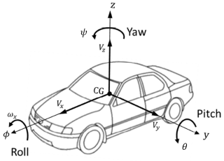

Figure 1 - Vehicle coordinate system (https://www.researchgate.net/publication/332561752_Adaptive_Robust_Vehicle_Motion_Control_for_Future_Over-Actuated_Vehicles/figures?lo=1&utm_source=google&utm_medium=organic)

**For transformations between the different presentation formats of coordinates the reference system Europäisches Terrestrisches Referenzsystem 1989 (ETRS89) (<ins>EPSG</ins>: <ins>25832</ins>) is used.**

Note that the format of using one absolute point and a relative description based on this point is chosen for the expected use case of studies of urban driving data. I.e. it is expected to mainly analyses data recorded at intersections etc. If data is recorded on longer drives (highway driving etc.), the data should be separated into several files with various absolute points in order to keep the transformation error low.

The absolute point used can be placed as desired (within the surroundings of the road network examined) by the person performing the data processing. If multiple recordings take place in the same area the same point should be chosen for all recordings. The same holds in case data is gathered through multiple methods (e.g. Drone data and AVL vehicle) at the same location. Both teams processing the data should chose the same reference point in order to keep the data comparable.

#### 2.8.1 Altitude
For altitude information of road position data and trajectories **"<ins>Höhe</ins> <ins>über</ins> <ins>Normalhöhennull</ins>" (NHN)** should be used. Whenever possible the newest version **"<ins>Höhen</ins> <ins>im</ins> <ins>Deutschen</ins> <ins>Haupthöhennetz 2016</ins>" (DHHN2016)** ([link](http://www.adv-online.de/icc/extdeu/nav/35e/broker.jsp?uMen=35e603fa-0c7b-f551-b803-e76372e13d63&SP_fontsize=2 "Deutsche Haupthöhennetz 2016 (DHHN2016)")) should be used instead of the older version DHHN92. Please note that this type of altitude information varies from ellipsoidal height information (measured with GPS). The difference varies throughout Germany and NHN altitude information is in Germany always smaller than the corresponding ellipsoidal height information.

When describing height information of buildings etc. and other objects the height above ground, i.e. the actual height of the object needs to be provided.

### 2.9 Trajectory

#### 2.9.1 Position
**The position of each object is described relative to the one absolute point described in the previous section.** The previously described UTM coordinate system is used to describe the axis. **For all road users or misc objects the geometrical center of the object is taken to describe the position.** The z-position is equivalent to the altitude.

#### 2.9.2 Heading

**The heading angle is defined as the angle around the z-axis.** This is true for the UTM coordinate system and the vehicle coordinate system. Therefore, the heading angle can be used to transform from one system into the other. Heading angles are provided in the mathematically positive direction (counter clockwise). **A heading angle of zero corresponds with the east direction (x-axis in UTM coordinate system). The heading angle is NOT given in the vehicle coordinate system, but in the UTM coordinate system. The heading angle is between 0 and 360 degree.**

 In the area of normal driving dynamics (which we expect in the data) it is assumed that heading and yaw are equivalent. Therefore, it is enough to save the heading angle of road users

#### 2.9.3 Pitch
The pitch angle is provided in the vehicles coordinate system. It is the angle in respect to the y-axis in the vehicle coordinate system. It is also provided in mathematically positive direction. An angle of zero corresponds to the x-y-plane. The pitch angle is defined in the mathematical positive sense, i.e., it is positive when stopping.It is given in degrees and is between 0 and +/-180. 
#### 2.9.4 Roll
The roll angle is provided in the vehicles coordinate system. It is the angle in respect to the x-axis in the vehicle coordinate system. It is also provided in mathematically positive direction. An angle of zero corresponds to the x-y-plane.

#### 2.9.5 Velocity
The velocity is provided in three directions in the vehicle coordinate system. This is the velocity in longitudinal direction (x-axis of vehicle coordinate system), the velocity in lateral direction (y-axis of vehicle coordinate system) and the velocity in z-direction. Please note that the y-axis (east-west axis) of the vehicle coordinate system points to the left while the x-axis (east-west axis) of the geodetical coordinate system points to the right.

#### 2.9.6 Acceleration
The directions for the acceleration are equivalent to the ones for the velocity. Please refer to previous section.

## 3. Attributes on Top Level

### 3.1 formatVersion
Version number of the input format used. Please provide number in the following format: version “x.y”. The format version is saved as an attribute.

### 3.2 RecorderNumber
The filename needs to be provided in order to be able to couple the data provided for the scenario database (ground truth) to the corresponding file for the sensor recording (perception database). The unique filename consists out of a recorderNumber and a recordingNumber. All information is saved as an attribute.

Partner numbers/identifiers are generated on request. For now we are certain that AVL and ika will deliver data. Therefore, those two are already assigned a number below

- 1: AVL
- 2: ika
- 3: DLR

### 3.3 RecordingNumber
The filename needs to be provided in order to be able to couple the data provided for the scenario database (ground truth) to the corresponding file for the sensor recording (perception database). The unique filename consists out of a recorderNumber and a recordingNumber. All information is saved as an attribute.

The numbers of the individual recordings can be chosen by the partner providing the data. It is important that those numbers are unique and that the ground truth recording and the corresponding sensor under test recording from the same drive get the same number.

### 3.4 converterVersion
The field converterVersion in the top level refers to the version number of the tool used to merge all data together (if this was the case)

Version number of merger used to merge map data, dynamic information and weather data. Can be provided as string in the format “x.y”.

### 3.5 referenceModality

Please provide the method used to gather the reference / ground truth data. This can e.g. be the use of infrastructure sensors, a measuring vehicle equipped with high class sensors (with and without human annotations), RTK GNSS system or drones. If the method that was used for the data is not contained in the list below, please select other and give some information in the customInformation field.

- 1: Measuring vehicle equipped with sensors and additional human labelling
- 2: Measuring vehicle equipped with sensors without any additional human labelling
- 3: Use of drones
- 4: Infrastructure sensors
- 5: RTK GNSS system
- 6: Other

### 3.6 customInformation
Please provide any additional information that you want the user / the analyst to have that does not fit into any other signal.

### 3.7 Natural Behavior
In order to be able to judge the extracted scenarios, it is important to note down if the data at hand was recorded during a purposely, planned and staged scenario or if the data represents naturalistic driving data. If the data represents non naturalistic driving data please set the flag to false otherwise it is set to true. If the recording is only performed via button push after witnessing an “interesting” situation, this would also be non-naturalistic data. The information is saved as an attribute. The flag is set as an attribute.

### 3.8 Natural Exposure
In order to calculate true exposure it is important to know if the scenario was purposely staged (see above) or naturalistic. If it was purposely staged, it can not have true exposure in the data, therefore, this flag needs to be set to false. If the recording is only performed via button push after witnessing an “interesting” situation, this would also be non natural exposure (set flag to false). Furthermore, the flag needs to be set to false if the data has been preprocessed to only upload “interesting” scenarios. The flag is set as an attribute.

### 3.9 Reference Point (refPointLat/refPointLong)
The two data fields are used to note down the latitudinal and longitudinal values of the chosen reference point. More information regarding the coordinate systems can be found in chapter 2.7. The information is saved as an attribute.

### 3.10 Daytime
The exact date and time at the beginning of the recording. The date needs to be saved in the format: yyyymmddhhmmss. It is saved as an attribute.

## 4. Road

### 4.1 converterVersion
Version number of the converter used in the format version „x.y“. In this case the converter used for the map information. Converter numbers for dynamic and weather data can be provided in separate fields. Along with the hdf5 data a short documentation on the converter used to convert the data into the format needs to be provided. The documentation should show which methods and algorithms were used to generate the data on the basis of which original data.

### 4.2 Location
Define were a road is located. This helps to have knowledge on the road type and rules that follow by that without using signs, such as speed limits. The information is saved as an attribute.

List:
- Urban = 1
  - Urban roads are located in built-up areas. It is usually characterized by a larger amount of surrounding civic buildings. The street is typically used by pedestrians, bicycles, cars, busses and trams. Usually a pavement divides the space for cars and pedestrians. Road markings are not necessary, but commonly used at crossroads and zones of dense traffic. Sometimes there are additional lanes for bicycles. Street lights are common. If not stated otherwise the speed limit is usually 50 km/h. Coming from non-Urban roads the beginning is marked with a yellow sign showing the towns name.

	
- non-Urban = 2
  - Non-Urban roads are those outside of built-up areas, connecting towns and townships. They lead through rural areas like fields and forests. There is a high variety in construction and road markings. Typically there are no street lights. Reflector posts at intervals of 50 m guide the course in the dark. Speed limitations depend on the construction and/or the streetmarks but are typically stated by signs.

	
- highway = 3
  - Highways have separate lanes for each driving direction, which are separated by guardrails. Guardrails can be on both side of the road. Access is only provided by on-ramps and restricted to vehicles that are able to drive at least 60km/h. The roads are wide and provided road markings. Like on every non-Urban road, reflector posts at intervals of 50 m conduct the road. Usually highways are separated from the surrounding area by vegetation and/or a wall/fence to prohibit trespassers. Mostly they head through rural area, connecting cities, but they can also lead through urban area.

	

### 4.3 Border
The group border is used to describe all borders of lane. Borders are the geometrical description of the lanes boundaries. Knowing the border of a lane, the outline of the lane is known. The description of the physical element (line, guard rail etc.) which conveys the border (if present) is described in the boundary group. Borders can be identified through their ID which is implicitly given through their placement within the file. Borders are described to polyline (order of points should be in driving direction if possible). If a lane is divided into multiple other lanes or connected to other lanes the first point of the new lane border should be the same as the last point of the old one.

## 5 Lane

### 5.1 Type
The information is saved as an attribute.

List:
- Driving = 1 (for everything that is none of the below)
- Shoulder = 2
  - Shoulders are marked parts of a road besides the driving lanes, provided to hold in case of emergency.

	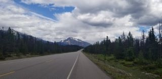
- bus_lane = 3
  - Driving lane for exclusive use by bus. Sometimes combined with a bicycle lane (see type below).

	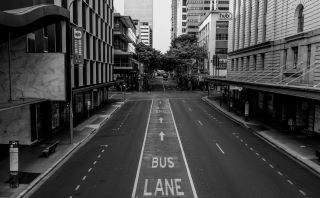
- bicycle_lane = 4
  - Driving lane for exclusive use by bicycles. When in between to driving lanes for cars, the bycicly lane is often marked red. Traversing is allowed but bicycles always hold the right of way. 

	
- on_ramp = 5
  - One-way road to access a highway. The on ramp tangents the highway at a point, followed by a section parallel to the highway. Provides space for acceleration and swapping into the trafficflow. 

	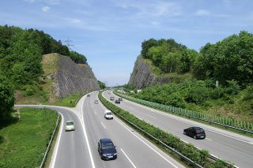
- off_ramp = 6
  - One-way road to grant departure of a highway. Provides space to slowdown without interfering with the trafficflow. Mostly begins with a parallel section before dividing from the highway in an angle.  

	
- shared_walkway = 7 (for pedestrians and bicycles)
  - Shared way for bicycles and pedestrians. Usually marked by traffic sign no. 240.

	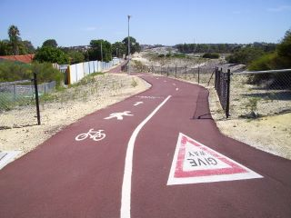
- walkway = 8
  - Only for pedestrians.

	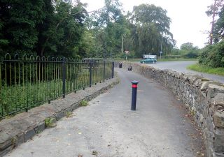
	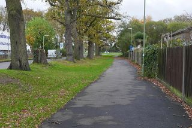
	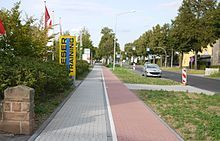

- carpool_lane = 9
  - A lane that is only permitted for vehicles with a minimum number of passengers. Also called high-occupancy vehicle lane. Often also authorized for low emission vehicles.

	
- bus_bicycle_lane = 10
  - Shared lane for bicycle and buses.

	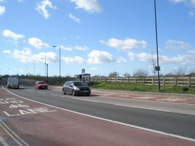
- bus_bay = 11
  - Cutout for exclusive use by bus – can be part of a stop.

	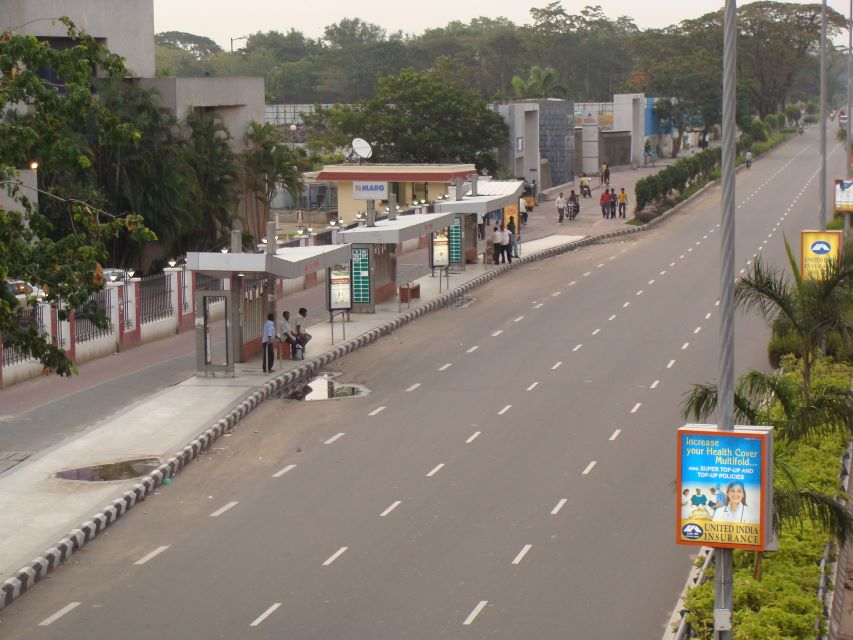
- vehicle turnout = 12
  - Cutout for emergency stops. Especially for roads without side-strip.

	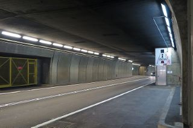
- keepout = 13
  - Area on the road that is closed to traffic. For security reasons e.g. at on- or off-ramps or at crosssections.

	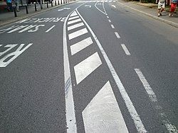
- rail = 14
  - Rails e.g. from a tram are embedded in the asphalt, crossings are either embedded or the roadway crosses the rail via a small ramp.

	
- vegetation = 15
  - Vegetation is planted e.g. in between the guard rails of a highway or besides the road. It can compromise the vision or hinder the traffic when not trimmed.

	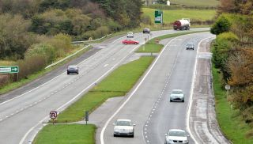
- freespace = 16 (should not be necessary to use)

### 5.2 Sub Type
Only used to note if the lane is part of a bridge or tunnel. Use ‘0’ if this is not the case.

List:
- Bridge = 1

	
- Tunnel = 2

	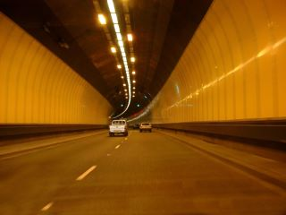

### 5.3 Class
Used to determine if a lane is part of an intersection or roundabout as this might be important for interpretation of the lane description.

List:
- Intersection = 1

	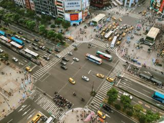
- Roundabout = 2

	
- None = 0

### 5.4 BorderRight/Left
borderRight is the field for the right border of a lane, while borderLeft is the field fort the left border of lane. Borders are the geometrical description of the lanes boundaries. Knowing the border of a lane, the outline of the lane is known. The description of the physical element (line, guard rail etc.) which conveys the border (if present) is described in the boundary group. The field contains the ID of a certain border described in the group ‘Border’. Separating all borders for a road from the lane description helps to reuse identical borders shared by two lanes.

### 5.5 invertedRight/Left
The points of a borders are usually desribed in the driving direction. However, when using the same border for two lanes this can lead to a problem. Imagine a road with two lanes each going in different directions. The border in between the two lanes is used by both lanes. For one it will be in driving direction and for the other it will not. Therefore, it is important to note down if the driving direction is inverted compared to the original description of the border. This can be noted down by a flag set to true, if this is the case. The information is saved as an attribute.

### 5.6 Predecessor/Successor
Individual lanes are connected through providing their predecessors and successors. More than one per lane is allowed and for example needed for merging or widening lanes. For instance, if one lane is separated into multiple (they can overlap), like at an intersection, the separated lane has multiple successors.

Predecessors/Successor IDs are tuples of two values ([roadID | laneID]). Therfore, the resulting data structure is a matrix where the amount of lines corresponds to the amount if predecessors/successors and the amount of columns equals 2.

## 6. Boundary
Boundary elements are separated from describing the border of a lane in this format. This has some advantages that are described below. The format allows multiple boundary elements for each lane border if desired. This allows to model, e.g. a line marking and a guard rail at the same time without having to define a separate narrow, un-driveable lane just to describe the additional guard rail. Furthermore, a boundary element does not need to be present along the whole border. Therefore, the signals polyIndexStart/End were introduced. The boundary group can also can be used for road equipment that needs to be placed in periodic distances, if one does not want to model every single item. In this case it is recorded that e.g. reflector posts are present, but there exact position is not documented. Depending on the different objects standard distances can be assumed. E.g., for reflector posts this is possible due to existing regulations. It is always possible to use the type XX to describe the boundary of the lane and model each individual object through road objects or signs if desired.

### 6.1 Type
The information is saved as an attribute.

List:
- Solid = 1

	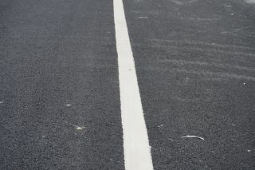
- Dashed = 2

	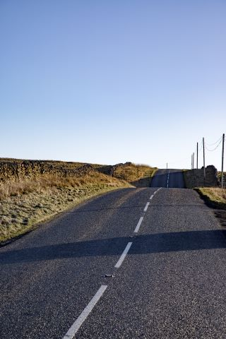
- solid_solid = 3

	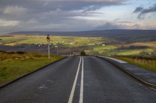
- solid_dashed = 4 (first mentioned type of line is the one on the inside of the lane, i.e. the one valid for the driver)
  - (vehicle driving on right hand side)

	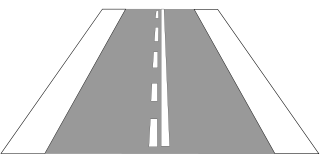
- dashed_solid = 5 (first mentioned type of line is the one on the inside of the lane, i.e. the one valid for the driver)
  - (vehicle driving on right hand side)

	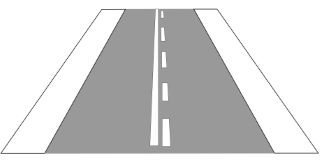
- dashed_changeDirectionLane = 6
  - Lanes that can be used for both directions (permission displayed on changable signs) are divided by double dashed lines.

	
- haptic_acoustic = 7 (boundary additional to one of the above to show that a marking provides haptic or acoustic feedback) 

	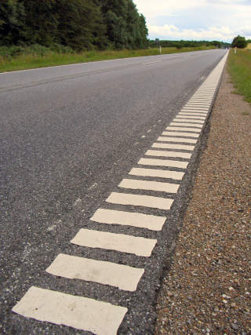
- studs = 8 (studs along lane are assumed to have a regular distance, but there exact position is not recorded)
  - Any kind of studs along the lane – used to warn driver from danger

	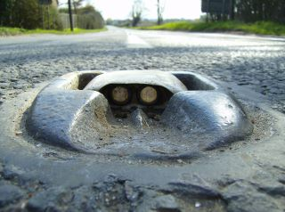
- reflector_guidingLamps = 9 (reflectors and guiding lamps are assumed to be regularly placed there exact position is not known. This could be managed through the use of road object)
  - Any reflectors or lamps along the lane

	
- guard_rail = 10
  - Guardrail along the road. Reflector posts can be placed with seperate border of type reflector_posts

	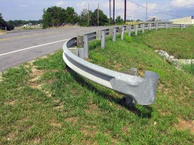
- guard_rail_accidentProtection = 11
  - Guradrail along the road with additional accident protection. Reflector posts can be placed with seperate border of type reflector_posts

	
- concrete_barrier = 12

	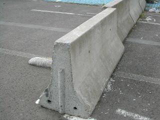
- reflector_posts = 13

	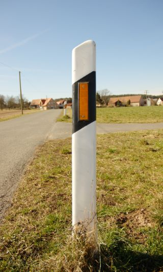
- safety_beacons = 14
  - All kinds of beacons (please also refer to traffic sign catalog https://www.bast.de/BASt_2017/DE/Verkehrstechnik/Fachthemen/v1-verkehrszeichen/vz-download.html?nn=1817946 from sign 600 upwards)

	
- divider = 15
  - any kind of divider not already mentioned (such as concrete barrier of safety beacons)

	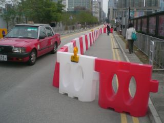
- noise_protection_wall = 16

	
- curb = 17

	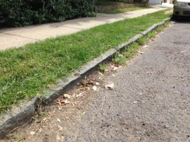
- anti_glare_screen = 18
  - Detachment in between two opposing lanes to reduce glare by frontlights.

	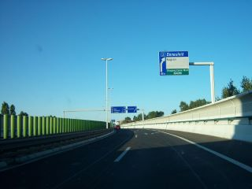
- fence = 19

	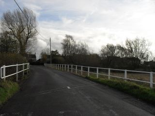
- virtual = 20 (a non-physical lane boundary, intended mainly for intersections)

	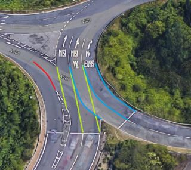
- misc = 21 (use if no boundary is present, but it is visually the boundary of the lane e.g. through change in surface material)

	
- structural_object = 22 (Use if a structural object is the boundary object of the lane e.g. for a sidewalk next to a building)

	

The proportion between dashed lines is not taken into consideration in this format. Generally there are options such as 1:2, 1:1 and 2:1 possible and described in road regulations [7]. This format will, however, not look at this and also not provide the possibility to model each line of a marking as a whole separately. This is considered unpractical and not needed. The proportion of lines can also be assumed by the road they are used on. Also the length of the individual lines can be gathered from this regulations. Please refer to Table 1 for more information on these regulations. Guiding lines are lines that are used as centerline to separate lanes, they are always thin (compare Table 2).

| Ratio |  | Line length in m / space length in m | Line length in m / space length in m  | Line length in m / space length in m  | Line length in m / space length in m |
| --- | --- | :-: | :-: | :-: | :-: |
| line length / space length | use case | Highway[^1] | other roads   non-urban | other roads   urban | bicycle lane |
| 1:2 | Guiding line of the junction-free road[^2], interrupted line of a one-sided lane limitation | 6,00/12,00 | 4,00/8,00 | 3,00/6,00 | - |
| 1:2 | Guiding line for bike paths | - | - | - | 1,00/2,00 |
| 1:2 | Interrupted lane limitations of the junction-free road | - | - | 1,00/0,50 | - |
| 2:1 | In general | 6,00/3,00 | 4,00/2,00 | 3,00/1,50 | - |
| 1:1 | Connecting ramp, additional lane | 6,00/6,00 | - | - | - |
| 1:1 | Interrupted bike lane limitation in a junction area | - | - | - | 0,50/0,50 |
| 1:1 | Guiding line in a junction area | - | 3,00/3,00 | 3,00/3,00 | - |
| 1:1 | Interrupted lane limitation | Additional junction area[^3] | 6,00/6,00 | 3,00/3,00 | 3,00/3,00 | - |
| 1:1 | Interrupted lane limitation | Narrower junction area[^3] | - | 1,50/1,50 | 1,50/1,50 | - |

[^1]: And similar roads according to StVO §42, Zeichen 330, III
[^2]: On Highways also on junctions that go through
[^3]: To the narrower junction area belongs the area which is used by crossing and turning road users. The additional junction area goes from there until the structural expansion.

Table 1 - Ratio of line length and gap length for longitudinal markings [7]

The format does not provide a type for a coupled solid and dashed line. This is on purpose as each lane has its own boundary descriptions to the left and the right hand side. Two lanes separated by a solid and a dashed line at the same time, i.e. showing that the one lane can make a lane change while the other one can not, can still be modeled each with the boundary that belongs to the specific lane. This has the advantage that the correct regulation implied by the marking is already connected to the correct lane.

### 6.2 Sub Type
The information is saved as an attribute.

- Thin = 1
- Thick = 2
- Metal = 3
- Wooden = 4

Subtypes can be used with their top level type. They are optional. Use a ‘0’ if subtype is not used.

Table 2 shows the different values of thin and thick markings depending on the road type.

|       | Highway | Other Roads |
| ----- | ------- | ----------- |
| Thin  | 0.15 m  | 0.12 m      |
| Thick | 0.3 m   | 0.25 m      |

Table 2 - Thickness of lane markings [7]

### 6.3 Right
Is this boundary element part of the left or the right border of a lane? If it is placed along the right border this is set to true, if not it is set to false. The information is saved as an attribute.

### 6.4 polyIndexStart/polyIndexEnd
Through the „Right“ flag it is known if the element belongs to the right or the left border of a lane. polyIndexStart describes the index of the point within that borders polyline where the boundary element starts. polyIndexEnd describes in the same way the index where the boundary element ends. If a boundary element is present along the whole border, the startIndex will be the first point of the polyline and the endIndex will be the last point of the polyline. Please note that you might need to take the flag “invertedRight/Left” into account when modelling. The index does always refer to the un-inverted order of points in the borders polyline. Therefore, the startIndex could be larger than the endIndex in some cases. The information is saved as an attribute.

### 6.5 Height
Boundary height is optional. It certainly does not make sense to provide it for regular lane markings. Guard rails etc. can usually also be assumed to have a standard height (0.75 m [7]). It is, however, possible to provide a height if desired. This might be useful for some cases of boundary. If no height is provided please provide an empty field (0x0 or 0x2 in hdf5 dataset). The information is saved as an attribute.

### 6.6 Color
List:
- white = 1
- yellow = 2
- green = 3
- red = 4
- unknown = 0

Color only needed for longitudinal markings as boundary. For other boundary elements color is assumed by their type. Guard rails for example are usually made of the same material and therefore have the same color. The information is saved as an attribute.

### 6.7 Condition
The information is saved as an attribute.

List:
- Fine = 1

	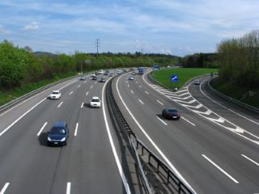

	
- corrupted_1 = 2

	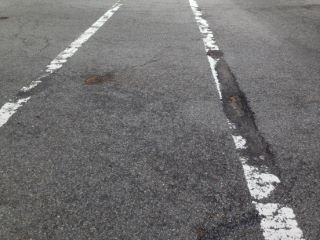
- corrupted_2 = 3

	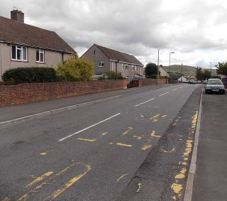
- unknown = 0

Condition is mostly relevant for longitudinal markings as boundary. Other boundaries could also show damage, but this is not essential to describe as for road markings. Therefore, condition classes developed for road markings are used to describe the condition of a boundary. Fine can be used if the marking is new or equivalent to new (no damage is visual). Corrupted 1 and 2 can be used for damaged markings in two categories depending on the amount of damage. Corrupted_1 is the first category and can be used if the marking shows damage and/or a reduced reflectance. Corrupted_2 can be used if more damage is present and the marking is nearly faded. The classification is dependent on the impression of the person generating the data.

## 7. Sign

### 7.1 Type
The information is saved as an attribute.
Catalog of signs used: https://www.bast.de/BASt_2017/DE/Verkehrstechnik/Fachthemen/v1-verkehrszeichen/vz-download.html?nn=1817946
Type is set to string as the numbering from the official BAST catalog is used and those types contain “-” and “.”.

Additional:
- tl_regular = 2000-1 (“normal” traffic light with regular round lights)

	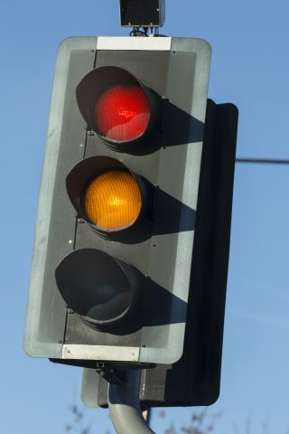
- tl_arrowStraight = 2000-2  

	
- tl_arrowRight = 2000-3  

	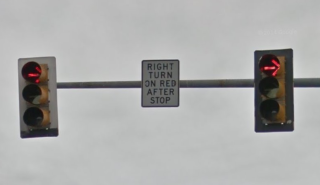
- tl_arrowLeft = 2000-4  

	
- tl_arrowStraightRight = 2000-5  

	
- tl_arrowStraightLeft = 2000-6  

	
- tl_pedestrian = 2000-7
  - Any kind of pedestrian traffic light. It does not matter what the manikin looks like.

	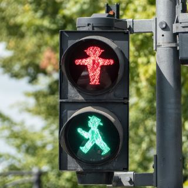
- tl_bycicle = 2000-8

	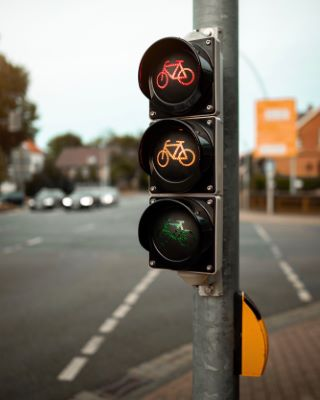
- tl_pedestrianBycicle = 2000-9  

	
- lightSingle = 2000-10 (single light, e.g. at railroad intersections (red) or warning lights)  

	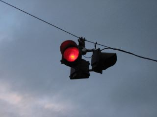
- tl_redAmber = 2000-11 (traffic light with only red and amber light, e.g. at railroad intersections)  

	
- laneLight = 2000-12 (light showing if lane is usable (green arrow, red cross or amber diagonal arrow)  

	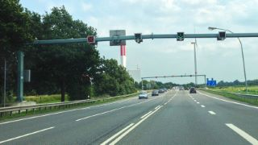
- busLight = 2000-13 (individual lights that can be combined on one pole (via signal connected to) that only apply for buses)  

	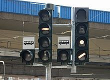
- switchable = 3000-1  

	
-

	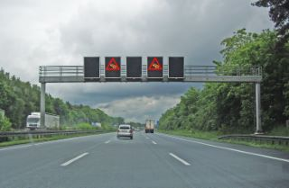
- barrier = 4000-1  

	
- unknown = 0

TL stands for traffic light. Switchable can be used if a sign is switchable. The corresponding value the sign is displaying can then be set by the state object (see chapter 15)

### 7.2 Value
The information is saved as an attribute.
Used for signs such as “1001-34” “auf … m” to provide the actual value. Provide actual value by number. Unit is known from sign type. For speed limit signs: Sub number describes value, e.g. “274-50” for speed limit 50 km/h. This is also the case for end of speed limit and recommended speed sign (blue).
For switchable signs, traffic lights and lane lights the current state of the sign (i.e. the value/sign it is displaying) needs to be noted down in the object state (see chapter 15).

### 7.3 Size Class
The information is saved as an attribute.

List:
- 1
- 2
- 3
- Unknown = 0

Traffic signs are standardized in size and grouped in three different groups. Sizes are dependent on the type of the sign. Table 3 shows the different sizes of the traffic signs.

|                          | 1 (70%)    | 2 (100%)   | 3 (125% or 140%)   |
| ------------------------ | ---------- | ---------- | ------------------ |
| Round (diameter)         | 420 mm     | 600 mm     | 750 mm (125%)      |
| Triangle (side length)   | 630 mm     | 900 mm     | 1260 mm (140%)     |
| Square (side length)     | 420 mm     | 600 mm     | 840 mm (140%)      |
| Rectangle (Height/Width) | 630/420 mm | 900/600 mm | 1260/840 mm (140%) |

Table 3 - Size classes of signs [7]

The sizes are dependent on the legal speed of the road. There are two different regulations depending on the type of the sign. The regulations are presented in Table 4 and Table 5.

| Speed in km/h | Size Class |
| ------------- | ---------- |
| 0 - 20        | 1          |
| >= 20 - 80    | 2          |
| >= 80         | 3          |

Table 4 - Speed areas for round signs [7]

| Speed in km/h | Size Class |
| ------------- | ---------- |
| <= 50         | 1          |
| 50 - 100      | 2          |
| >= 100        | 3          |

Table 5 - Speed areas for triangular, square or rectangular shaped sings [7]

### 7.4 History
The symbols on signs may have changed in their design over the years. While the meaning of a sign is still the same the symbol might be slightly different. In some rural areas or rarely used roads those old signs might still be present. In general, the format sticks to the signs found here: https://www.bast.de/BASt_2017/DE/Verkehrstechnik/Fachthemen/v1-verkehrszeichen/vz-download.html?nn=1817946

If there is the need to additionally note down that the sign might be an older version, this can be done in this field. Please note down the year the sign with the symbol, as it is present, was introduced and the “Zeichen/Bild” number. E.g. “1971 Bild 22” for an old version of no through road for motorcycles. Please make sure that the Type field still contains the correct number for the current (2017) sign. The history field is just an additional optional field that can be used if desired and needed. The history of the signs and there corresponding names can be found here:  https://de.wikipedia.org/wiki/Bildtafeln_der_Verkehrszeichen_in_Deutschland. If the sign is up-to-date or one does not want to provide a history, please use “0” to indicate this. The information is saved as an attribute.

### 7.5 Timedependent/Weatherdependent
Two bool flags used to note if a sign is time- or weather dependent. The actual value of the sign is saved within the type. This is just an additional flag to later filter for such signs. The sign can be connected to the sign making it weather or time dependent through “connected to”, if one wishes to document such a sign, too (might be necessary in some cases where the additional sign contains the actual time information). The information is saved as an attribute.

### 7.6 Applicable Lanes
Vector of lane Ids this sign applies to. If a sign is temporarily not valid due to it being crossed out, this can be shown by not making it apply to any lanes (additionally it needs the layer flag and the overrides field set correctly). Lane IDs always consist out of two values (RoadID and LaneID), therefore the applicable lanes field will be a matrix where the amount of lines corresponds with the amount of lanes the sign is applied to and the amount of columns equals two (for the IDs). If the sign does not apply to any lane this field will should be empty (0x0 or 0x2 in hdf5 dataset).

### 7.7 Connected To
Provide the ID or several IDs this sign is connected to. This should be used to connect traffic lights that are within one controller, but also to connect signs with their additional information signs (usually rectangular white signs). Also for additional signs at traffic lights used as fallback (see next section). The connected to works as cross reference (needs to be noted for both signs). The resulting data structure can either be a vector containing the ID Tuple (RoadID|SignID), if the sign is only connected to one other sign or a matrix where the number of lines corresponds to the number of signs the current signs is connected to (e.g. for traffic lights). If the sign is not connected to any other sign, this field will should be empty (0x0 or 0x2 in hdf5 dataset). The information is saved as an attribute.

### 7.8 Fallback
Mark if a sign is only used as a fallback (bool flag). For instance, a yield sign at a traffic light that is only applied if the traffic light is broken. Which traffic sign is in place if the traffic light is broken can be found out through connected to. The information is saved as an attribute.

### 7.9 Polyline
The position of the sign is reported through one single point. The point features a x,y and z coordinate. The z coordinate describes the height of the sign. Using more points to report the size of the sign is not necessary as signs are standardized (see above). Similar to previously mentioned polyline descriptions, the data format needs to contain a field for posX, posY and posZ.

### 7.10 Heading
It is assumed that a traffic sign points in the direction of the lanes it is applied to. If a traffic sign is rotated around its height axis, this angle is noted down in heading. If no distortion please leave field empty (0x0 or 0x2 in hdf5 dataset). The information is saved as an attribute.

## 8. Flat Marking

### 8.1 Type
The information is saved as an attribute.

List:
- notice_arrow = 1 (Vorankündigungspfeil. In driving direction)

	
- zig_zag = 2 (Stopping/Parking restrictions)  

	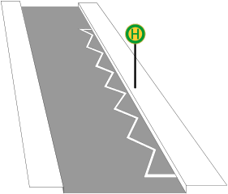
- keepout_area = 3  

	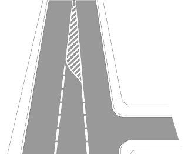
- arrow_left = 4  

	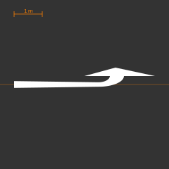
- arrow_right = 5  

	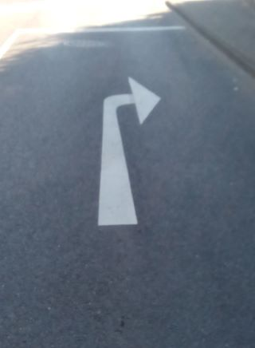
- arrow_left_right = 6  

	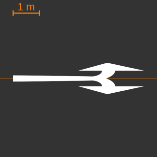
- arrow_left_Straight = 7  

	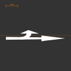
- arrow_right_Straight = 8  

	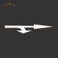

- arrow_left_straight_right = 9  

	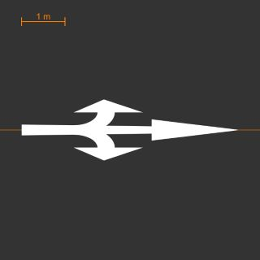

- arrow_straight = 10

	
- vehicleFront = 11  

	
- truck = 12  

	
- bicycle = 13  

	
- deliveryBike = 14  

	
- pedestrian = 15  

	
- horseRider = 16  

	
- cattleDrive = 17  

	
- tram = 18  

	
- bus = 19  

	
- vehicle = 20  

	
- vehicleMultiplePassengers = 21  

	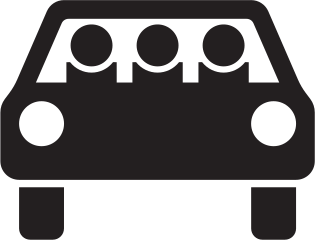
- pkwWithTrailer = 22  

	
- truckWithTrailer = 23  

	
- mobileHome = 24  

	
- tractor = 25  

	
- motorcycle = 26  

	
- moped = 27  

	
- electricBicycle = 28  

	
- eScooter = 29  

	
- carriage = 30  

	
- snowIce = 31  

	
- rockfall = 32  

	
- gravel = 33  

	
- movableBridge = 34  

	
- shore = 35  

	
- crosswalk = 36  

	
- amphibian = 37  

	
- avenue = 38  

	
- plane = 39  

	
  
- electricalVehicle = 40  

	
- carsharing = 41  

	
- **Each sign within the sign catalog. See above (section 7.1).**

### 8.2 Value
Possibility to note a specific value of something painted on the road (compare to value within object type sign). Probably not needed as speed signs can be referenced specifically through their catalog number. This field will should be empty (0x0 or 0x2 in hdf5 dataset) if not used. The information is saved as an attribute.

### 8.3 Polyline
For the position of the marking either one or two points (x,y,z) on the road can be provided. If one point is provided this is assumed to be the center of the marking. A specific size can then not be provided. A standard is assumed. If providing two points this is assumed to be the center line of the marking (in longitudinal road direction). This gives the possibility to describe the longitudinal extension if desired. Similar to previously mentioned polyline descriptions, the data format needs to contain a field for posX, posY and posZ.

### 8.4 Color
The information is saved as an attribute.

List:
- White = 1
- Yellow = 2
- Green = 3
- Red = 4
- Blue = 5
- Unknown = 0

Colors white and yellow are to be expected. Other colors for markings (except signs painted onto road in color, in those cases no color needs to be specified as this becomes clear from the sign catalog) are rare.

### 8.5 Condition
The information is saved as an attribute.

List:
- Fine = 1  

	
- corrupted_1 = 2  

	
- corrupted_2 = 3  

	
- unknown = 0

Fine can be used if the marking is new or equivalent to new (no damage is visual). Corrupted 1 and 2 can be used for damaged markings in two categories depending on the amount of damage. Corrupted_1 is the first category and can be used if the marking shows damage and/or a reduced reflectance. Corrupted_2 can be used if more damage is present and the marking is nearly faded. The classification is dependent on the impression of the person generating the data.

## 9. Lateral Marking

### 9.1 Type
The information is saved as an attribute.

List:
- stop_line = 1  

	
- hold_line = 2  

	
- pedestrian_crossing_line = 3  

	
- bicycle_crossing = 4  

	
- crosswalk = 5  

	
- reflectors_lamps = 6  

	
- shark_tooth = 7 (new in catalog since 2020)  

	
- unknown = 0

### 9.2 Polyline
The lateral marking is described by a polyline that pictures the course of the marking as a centerline. Similar to previously mentioned polyline descriptions, the data format needs to contain a field for posX, posY and posZ.

### 9.3 LongSize
As the center line does not provide the chance to describe the size in longitudinal direction of the marking, e.g., the width of a pedestrian crossing, it can optionally be provided here. For most types a standard size is assumed if nothing is provided. Those standard values can be found in Table 6. A crosswalk is always assumed to be at least three meters in width. Please provide an empty field (0x0 or 0x2 in hdf5 dataset) if this field is not used and the information is not given. The information is saved as an attribute.

| Name | Measures | Type |
| --- | --- | --- |
| Lateral solid line | Width: 0.5 m | Stop line |
| Dashed lateral line (2:1) | Width 0.5 m   Length per line: 0.5 m   Distance between lines: 0.25 m | Hold line |
| Dashed lateral line (2.5:1) | Width: 0.12 m   Length per line: 0.5 m   Distance between lines: 0.2 m | Pedestrian crossing line |
| Dashed lateral line (2.5:1) | Width: 0.25 m   Length per line: 0.5 m   Distance between lines: 0.2 m | Bicycle crossing |
| Crosswalk | Width: >= 3 m   Length per line: 0.5 m   Distance between lines: 0.5 | crosswalk |

Table 6 - Standard sizes for lateral markings [7]

### 9.4 ApplicableLanes
Vector of lane IDs which this marking does apply to (roughly speaking: on which it is painted). It is assumed that the marking is only painted on lanes that belong to the current road.

### 9.5 Color
The information is saved as an attribute.

List:
- White = 1
- Yellow = 2
- Green = 3
- Red = 4
- Blue = 5
- unknown = 0

Colors white and yellow are to be expected. Other colors for longitudinal markings are rare or never seen.

### 9.6 Condition
The information is saved as an attribute.

List:
- Fine = 1  

	
- corrupted_1 = 2  

	
- corrupted_2 = 3  

	
- unknown = 0

Fine can be used if the marking is new or equivalent to new (no damage is visual). Corrupted 1 and 2 can be used for damaged markings in two categories depending on the amount of damage. Corrupted_1 is the first category and can be used if the marking shows damage and/or a reduced reflectance. Corrupted_2 can be used if more damage is present and the marking is nearly faded. The classification is dependent on the impression of the person generating the data.

## 10. Surface

### 10.1 Material
The information is saved as an attribute.

List:
- Asphalt = 1
  - Composite material consisting of mineral aggregate bound together with bitumen. There are different kind of mixtures, varying in fineness. If not damaged in any way, evenly distributed, plain surface. Aspahlt is a flexible material and of dark color.  

	
- Concrete = 2
  - Composite material consisting of mineral aggregate bound together with cement. There are different kind of mixtures, varying in fineness. If not damaged in any way, evenly distributed, plain but often grooved surface. Concrete is often used for truck driven lanes because of its hardness. It is of a light color.  

	
  - Concrete road surfaces can be laid in panels, glued together with bitumen.   
- Brick = 3 (this includes granite setts and cobblestones)
  - Brick surface consists of pavers in slightly varying size. The gaps between the pavers is filled with grout. The surface of each paver is sleek and shiny when wet, total area appearance is a little bumpy.  

	
- Gravel = 4 (this means anything loose in general)
  - Surface consists of compacted material of different types, e.g. mud, rubble, macadam or other types of soil. Sometimes a binder is used to prevent the gravel from raising dust. Surface is flattened but typically has loose pieces in it.  

	
- Unknown = 0

Brick includes cobbles etc. Gravel includes everything that has no coating layer. Unknown should only be used if nothing matches the situation at all or really unknown and indeterminable from road type and surrounding. This should not be the case.

### 10.2 Color
The information is saved as an attribute.

List:
- Green = 3
- Red = 4
- White = 1
- Anthracite = 6
- Brown = 7
- Unknown = 0

Only necessary to describe color of surface if it deviates from usual color of the specified material. For asphalt, e.g., grey is assumed.

### 10.3 Condition
The information is saved as an attribute.

List:
- Fine = 1  

	
- Cracks = 2  

	
- Bitumen = 3
  - Dark glue material, that is also component of asphalt, used to fix cracks in the surface.  

	 ![Bitumen_2" width="200"/>
- pot_holes = 4  

	
- ruts = 5  

	
- damaged = 6  

	
- no_value = 0

Possibility to provide the condition of the road without needing to describe single potholes, ruts or bitumen elements (this is, however, possible if this level of detail is desired through their exact position as road objects). If using condition the general condition of the road can be noted down if desired. Which classification is chosen depends on the person generating the data. Fine describes road in okay state that does not contain many cracks, potholes etc. Cracks, bitumen, ruts and pot_holes can be used if one of those is largely present throughout the outline of the road. If a combination of this is present the type damaged can be used.

## 11 Road Object

### 11.1 Type
The information is saved as an attribute.

List:
- street_lamp = 1
  - Illumination of any kind, mostly attached on a pole besides the road.  

	
- traffic_island = 2
  - Isle in between two traffic lanes. Used to direct traffic in a certain way. When also or mainly used as a pedestrian facility for easing a traverse it is categorized as a crossing aid (see „5“).  

	
- roundabout_center = 3
  - Center of a roundabout. Can be asphalt with road markings, other traversable coverings with visible boundaries, shallow vegatation or some kind of decoration.  

	

- parking = 4
  - Use to model any kind of parking area, e.g., parking spots on the side of the road. Can be parallel to the road or in an angle. Often visual through structural boundary or road marking. Parking spots can be modelled individually, but do not need to. If there are several parking spots connected to each other they can also be modelled as one road object.  

	
- crossing_aid = 5
  - Isle in between two traffic lanes. Used as a pedestrian facility for easing a traverse.  

	
- speed_bump = 6
  - Slight elevation in road surface to force deceleration. Can be made of asphalt, concrete, pavers or plastics. Is visibly announced by sharktooth or other noticable road markings.  

	
- pot_hole = 7
  - Any type of hole in the road surface.  

	
- reflector = 8
  - Reflecting element on or besides the road, e.g. reflector posts, safety beacons or similar objects.  

	

- stud = 9  

	

- bollard = 10
  - Bollard to prevent vehicles from driving onto an area, protect pedestrians  

	
- crash_absorber = 11

	
  - Element to lower impact damage and/or to reroute vehicle from an object.  
- bitumen = 12
  - Dark glue material, that is also component of asphalt, used to fix cracks in the surface. Can impair vehicle handling (especially of single lane vehicles – moped, bikes, …).       
  - Aggregation of water on the road surface of any size.  

	
- misc = 17
- unknown = 0

Please note that pylons, beacons and reflector posts can be placed as signs as they are within the sign catalog.

### 11.2 Polyline
The polyline describes the outline (on the ground) of the road object in x,y and z coordinates. The height can optionally be provided in the field Height. Similar to previously mentioned polyline descriptions, the data format needs to contain a field for posX, posY and posZ.

### 11.3 Height
If needed the height of a road object can be provided here. If no height is provided please provide an empty field (0x0 or 0x2 in hdf5 dataset). The information is saved as an attribute.

### 11.4 Driveable/walkable
This flag is additional to note down if it is possible to drive or walk on a specific road object. The information is saved as an attribute.

## 12 Structural Object

### 12.1 Type
The information is saved as an attribute.

List:
- not_declared = 0
  - any kind of roadside structure that needs to be described, but does not match any oft he below.
- vegetation = 1
  - Any kind of vegetation that affects the road. For example an alley or a hedge that affects vision.  

	
  
- building = 2
  - Any permanent structure nearby the road that does not belong into another group defined here.  

	
- busshelter = 3
  - Simple, open structure to protect passengers from wind and rain. At least one wall with a roof, often build of glass but can be wooden in rural areas.  

	
- tunnel = 4
  - Structure to lead the road below surface level or beneath an obstacle, e.g. an (railway) underbridge.  

	
- bridge = 5
  - Structure to lead the road across an obstacle, e.g. another road or a river.  

	
- fence = 6
  - Open, slight structure to prevent trespassing. Can also be used to disguise visibility.  

	  
  
- bench = 7
  - Any seating at the roadside.  

	
- road_work = 8
  - Road work or road rapair work that changes usual traffic situation. May prohibit use of a lane or changes the right of way.  

	
- body_of_water = 9
  - Body of water besides the road.  

	
- garage = 10
  - Garage or parking position with structural protection for the car. Also includes large parking garages.  

	
  
- billboard = 11  

	
  
- advertising_pillar = 12  

	
- phone_box = 13  

	
- post_box = 14  

	
- overhead_structure = 15  

### 12.2 Polyline
The polyline of the structural objects describes the base area of the object in x,y and z coordinates. The height of the object itself needs to be provided in the additional field for height. Similar to previously mentioned polyline descriptions, the data format needs to contain a field for posX, posY and posZ.

### 12.3 Height
The height above ground of the structural object. If no height is provided please provide an empty field (0x0 or 0x2 in hdf5 dataset). The information is saved as an attribute.

## 13 Road User

### 13.1 converterVersion
Version number of the converter used in the format version „x.y“. In this case the converter used for the dynamic information (road users etc.). Converter numbers for map and weather data can be provided in separate fields. Along with the hdf5 data a short documentation on the converter used to convert the data into the format needs to be provided. The documentation should show which methods and algorithms were used to generate the data on the basis of which original data.

### 13.2 Type
The information is saved as an attribute.

List:
- car = 1
  - includes cars, vans, SUVs and pickup trucks  

	
  
- truck = 2
  - includes tractor units, smaller trucks etc.  

	
  
- bus = 3
  - includes all types of busses (> 10 persons), trolley busses, bendy busses etc. (see subtypes)  

	
  

	
- motorcycle = 4
  - includes all types of motorized two wheelers (motorcycles, mopeds etc., no electric bicycles). Includes rider of two wheeler if present.  

	
  
- bicycle = 5
  - includes all types of bicycles (electric, manual etc.). Includes rider of bicycle if present.  

	
  

	
- pedestrian = 6
  - includes all types of pedestrians (children, adults, police officers etc.). Does not include people in wheel chairs, riding on bicycles, riding on motorcycles, using skateboards etc. (see other categories for such)  

	
- pushable_pullable = 7
  - includes all pusable or pullable object such as trolleys, shopping carts, strollers etc.). Does not include wheel chairs (see category wheel chair)  

	
  

	
- wheelchair = 8
  - any kind of wheelchair with or without rider (see sub types)  

	
- personal_mobility_device = 9
  - includes skateboards, skaters, scooters, segways etc. No matter if with or without rider (see sub types)  

	
  

	
- trailer = 10
  - includes all kinds of trailers. See subtypes for more details  

	
- farming = 11
  - any kind of farming machine: tractor etc.  

	
- rail = 12
  - any kind of vehicle moving on rails: tram, train etc. Individual wagons are labeled as trailers  

	
- carriage = 13
  - e.g. horse powered carriage or so called beer bikes etc.  

	

### 13.3 Sub Type
Sub types can be used to provide additional information regarding the entities above. In case of with_rider and without_rider they are important and should always be included. For other entities they might only be an additional information, e.g., to specify the entity type more precisely. Sub types listed under “in general” can be used for all entities above. Note that there is always only one single subtype. If no subtype is provided it is assumed that the entity is of the “normal”, top level type. E.g. in case of a bus: if an object has the type bus and does not feature a subtype, the object is a regular bus. If it features the sub type trolleybus it is a bus and more precisely a trolleybus. If no subtype is provided this field will be empty (0x0 or 0x2 in hdf5 dataset) for the road user. The information is saved as an attribute.

- In general:
  - emergency = 1  

	
	
	
	
 
  - construction = 2  

	
  	
  	
  	
- Truck
  - Street_cleaning (garbage truck, road sweeper etc.) = 3  

	
- Bus
  - Trolleybus = 3
    - Bus connected to power lines (restricted in ist movement)  

	
  - Bendy bus = 4
    - Propelled unit of the bendy bus (front)  

	
- Motorcycle
  - With rider = 3  

	
  - Without rider = 4
    - Motorcycle being parked  

	
- Bicycle
  - With rider = 3  
  - Without rider = 4
    - Bicycle being pushed or standing around  

	
- Pedestrian
  - Child = 3  

	
  - Adult = 4  

	
- Wheelchair
  - With rider = 3  

	
  - Without rider = 4  

	
- Personal_mobility_device
  - With rider = 3
    - Any kind of personal mobility device (electric or self propelled) were rider usually travels in upright position and rider is present  

	
  - Without rider = 4
    - Any kind of personal mobility device (electric or self propelled), but not featuring a rider  

	
- Trailer
  - Car trailer = 3
    - Smaller trailer usually connected to cars  

	
  - Caravan = 4  

	
  - Truck trailer = 5
    - Trailer that can be connected to a truck. Note that the unit of tractor unit and the trailer is also often called truck. In this case the tractor unit and the trailer are separate entities. In case a truck + its trailer are carrying other vehicles those vehicles do not need to be labeled separately.  

	
  - Train trailer = 6
    - Wagons on a train or tram  

	
  - Bendy bus trailer = 7
    - „trailer“ of a bendy bus  

	
### 13.4 Connected to
Mostly for trailers. Connect to vehicles via ID if necessary. Use crossreference. This field should be empty (0x0 or 0x2 in hdf5 dataset) if the road user is not connected to another. The information is saved as an attribute.

### 13.5 birthStamp
The birth stamp provides the index in the timestamps vector at which the road user was “born”, i.e., was first seen in the scenario. The index counting starts with 0. Example: If the birthStamp of a road user is 10, is trajectory starts at timestamp[10] (i.e. the 11th entry in the timestamps vector). The information is saved as an attribute.

### 13.6 Trajectory
The trajectory for each road user is provided in its center point. For more information refer to Chapter 2.9.

### 13.7 isDataRecorder
This bool value needs to be set to true if the current road user is the vehicle recording the data used for ground truth (DGT). If data recording is not done with test vehicle, but, e.g., with a drone, this value will always be false. The information is saved as an attribute.

### 13.8 Bounding Box
The bounding box contains width, height and length of a box around the road user.

#### 13.8.1 **Length**
In order to provide the trajectory of the object in its center point it might be necessary, depending on the way the recording was made, to calculate the center point with the help of length and width of the vehicle. Therefore, the determined length needs to be noted down here. This is particularly needed for cars and trucks etc. Not so much for pedestrians or bicycles. The information is saved as an attribute.

##### 13.8.1.1 **Confident**
Additional information on the confidence of the length provided. The value can be either a ‘0’ or a ‘1’. Zero means that the value provided is just assumed and not precisely measured. One means that the value is precisely measured. This is additional information that might be valuable when checking data and analyzing “odd looking behavior” that might be due to uncertain center point calculations.

#### 13.8.2 **Width**
Same as above just for the width of the vehicle. The information is saved as an attribute.

##### 13.8.2.1 **Confident**
Additional information on the confidence of the width provided. The value can be either a ‘0’ or a ‘1’. Zero means that the value provided is just assumed and not precisely measured. One means that the value is precisely measured. This is additional information that might be valuable when checking data and analyzing “odd looking behavior” that might be due to uncertain center point calculations.

#### 13.8.3 Height
Height of road user. Height is not as important as length and width as it is not needed for the calculation of the center point. If height is not known, please use negative value to show this. The information is saved as an attribute.

### 13.9 Vehicle Lights
All vehicle lights fields are filled at every timestamp.

#### 13.9.1 **indicatorRight**
- 1 = switched on
- 0 = switched off
- -1 = unknown

#### 13.9.2 **indicatorLeft**
- 1 = switched on
- 0 = switched off
- -1 = unknown

#### 13.9.3 **brakeLights**
- 1 = switched on
- 0 = switched off
- -1 = unknown

#### 13.9.4 **Headlights**
- 1 = switched on
- 0 = switched off
- -1 = unknown

#### 13.9.5 **reversingLights**
- 1 = switched on
- 0 = switched off
- -1 = unknown

#### 13.9.6 **blueLight**
- 1 = switched on
- 0 = switched off
- -1 = unknown

## 14. Misc Object

### 14.1 Type
The information is saved as an attribute.

List:
- Animal = 1  

	
- play_equipment = 2  

	
- misc = 3  

	

### 14.2 Sub Type
The information is saved as an attribute.

Animal:
- Dog = 1  

	
- Cat = 2  

	
- Horse = 3  

	
- Bird = 4  

	
- Wild = 5  

	 ![wild_2" width="200"/>

Sub types can be used optionally with their specific top level type. If the animal that needs to be described does not match any subtype leave it empty (0x0 or 0x2 in hdf5 dataset).

### 14.3 Trajectory
The trajectory for each misc object is provided in its center point. For more information refer to Chapter 2.9.

### 14.4 birthStamp
Compare 14.4. The information is saved as an attribute.

### 14.5 Bounding Box
The bounding box contains width, height and length of a box around the object.

#### 14.5.1 Length
In order to provide the trajectory of the object in its center point it might be necessary, depending on the way the recording was made, to calculate the center point with the help of length and width of the vehicle. Therefore, the determined length needs to be noted down here. This is particularly needed for cars and trucks etc. Not so much for pedestrians or bicycles. The information is saved as an attribute.

#### 14.5.2 Width
Same as above just for the width of the object. The information is saved as an attribute.

#### 14.5.3 Height
Height of object. Height is not as important as length and width as it is not needed for the calculation of the center point. If height is not known, please use negative value to show this. The information is saved as an attribute.

## 15. State
Traffic lights, switchable traffic signs etc. have a certain state that can change over time. A list of possible states can be found in the following. Not all states can be used with all traffic signs. E.g. a switchable traffic sign can have the value of any sign in the traffic sign catalog while a traffic light can change its different phases (red, green etc.)

### 15.1 ReferenceID
Provide ID of sign/traffic light described in road section for which the states apply to. The ID of a sign consists out of two values one for the roadID and one for the signID.

### 15.2 Value
List:
- For switchable signs: All signs within the sign catalog https://www.bast.de/BASt_2017/DE/Verkehrstechnik/Fachthemen/v1-verkehrszeichen/vz-download.html?nn=1817946
identified through their sign number
- Green = 1  

	
- Amber = 2  

	
- Red = 3  

	
- redAmber = 4  

	
- flashing_amber = 5  

	
- flashing_red = 6  

	
- green_arrow = 7 (for lane lights)  

	
- red_cross (for lane lights)  

	
- amberDiagonalArrowRight = 9 (for lane lights)  

	
- amberDiagonalArrowLeft = 10 (for lane lights)  

	
- active = 11 (e.g. for barriers)  

	
- inactive = 12 (e.g. for barriers)  

	
- bus_stop = 13 (bus needs to stop)  

	
- bus_straight = 14 (bus can go straight)  

	
- bus_right = 15 (bus can go to the right)  

	
- bus_left = 16 (bus can go to the left)  

	
- bus_stopExpected = 17 (bus signal will switch to hold. Sometimes also used to show that bus traffic light will turn “green” (see below also))  

	
- bus_yield = 18  

	
- bus_willSwitch = 19  (used in some cities to show that the traffic light will turn „green“ in a few seconds or will turn green if the driver closes the doors. Sign differs from city to city)  

	
- unknown = 0

## 16. weather

For gaining weather data different weather services were checked (Open Weather Map, Here Weather API and Climate Data Center by Deutscher Wetterdienst (DWD) [link](ftp://opendata.dwd.de/climate_environment/CDC/observations_germany/climate/hourly/)). It was found that DWD data provides the most data in a detailed manner which is also free of charge. If available at other services the data of the input data format can also be filled using different services. This format, however, sticks very close to the information provided by the DWD as as of today no weather sensors are planned and most data will very likely come from the DWD Climate Center. Most definitions below are made using input from [8] and [9].

### 16.1 converterVersion
Version number of the converter used in the format version „x.y“. In this case the converter used for the weather information. Converter numbers for map and dynamic data can be provided in separate fields. Along with the hdf5 data a short documentation on the converter used to convert the data into the format needs to be provided. The documentation should show which methods and algorithms were used to generate the data on the basis of which original data.

### 16.2 Source
For all fields source describes the source from which the weather data is gained. The information is saved as an attribute.

List:
- DWD = 1
- External_sensor = 2
- Unknown = 0

### 16.3 Weather Sation ID
Fill this field with ID of weather station when using DWD data. The information is saved as an attribute.

### 16.4 Precipitation

#### 16.4.1 Amount Minute / Amount Hourly
The Climate Data Center by DWD offers precipitation data on an hourly-, a ten minute- and a minute basis. The format neglects the ten minute value and only handles the hourly and the minute value. The hourly value in mm/h is a regular way and unit to measure precipitation. It can be used no matter what source (DWD Data or weather sensors on test vehicle etc.). However, depending on the resolution of this data it might not be sufficient to describe the conditions in later extracted scenarios (which have a typical length of about 20 seconds). Therefore, the format additionally allows to store (DWD) data that is updated with a one minute rate. When using DWD data both values are necessary as the value updated every minute sometimes abolishes precipitation due to its small value, but the hourly and minute value together can give a better indication of not only if it rained, but also when it rained within that hour. If other weather sensors are used, it is still possible to use the hourly value and update it every time step according to the output rate of the sensor (values in between can be kept constant).

#### 16.4.2 Type
Type declaration should be made from hourly value. Type decleration by amount of rain is also possible by other values through simple calculation for different time spans (see table blow). However, the DWD data only offers the type of precipitation through WR-Code in the hourly data. Therefore, it is advisable to use those for the type decleration.

| Type | Amount (1 Minute) | Amount (10 minutes) | Amount (Hourly) | Description | DWD Name |
| --- | --- | --- | --- | --- | --- |
| 0 | 0 mm | 0 mm | 0 mm | No rain | 0 - kein Niederschlag gefallenen und/ oder keine Niederschlagshöhe aus abgesetzten Niederschlägen (wie Tau, Reif), bei automatischen Stationen entspricht das der WMO-Code-Zahl 10 |
| 1 | <0.05 mm | <0.5 mm | <2.5 mm | Light rain | 6 - gefallener Niederschlag nur in flüssiger Form, kann auch abgesetzten Niederschlag jeder Art enthalten, bei automatischen Stationen entspricht das der WMO-Code-Zahl 11 |
| 2 | >=0.05mm-0.17mm | >=0.5-1.7mm | >=2.5-10mm | Moderate rain | 6 - gefallener Niederschlag nur in flüssiger Form, kann auch abgesetzten Niederschlag jeder Art enthalten, bei automatischen Stationen entspricht das der WMO-Code-Zahl 11 |
| 3 | >=0.17mm-0.83mm | >=1.7-8.3mm | >=10mm - 50 mm | Heavy rain | 6 - gefallener Niederschlag nur in flüssiger Form, kann auch abgesetzten Niederschlag jeder Art enthalten, bei automatischen Stationen entspricht das der WMO-Code-Zahl 11 |
| 4 | >=0.83mm | >=8.3mm | >50 mm | Extremely heavy rain | 6 - gefallener Niederschlag nur in flüssiger Form, kann auch abgesetzten Niederschlag jeder Art enthalten, bei automatischen Stationen entspricht das der WMO-Code-Zahl 11 |
| 5 | < 0.02 mm | <0.2 mm | <1.0 mm | Light snow | 7 - gefallener Niederschlag nur in fester Form, kann auch abgesetzten Niederschlag jeder Art enthalten, bei automatischen Stationen entspricht das der WMO-Code-Zahl 12 |
| 6 | >=0.0.2-0.09mm | >=0.2-0.9 mm | >=1.0-5.0mm | Moderate snow | 7 - gefallener Niederschlag nur in fester Form, kann auch abgesetzten Niederschlag jeder Art enthalten, bei automatischen Stationen entspricht das der WMO-Code-Zahl 12 |
| 7 | >=0.09mm | >=0.9 mm | >=5.0mm | Heavy snow | 7 - gefallener Niederschlag nur in fester Form, kann auch abgesetzten Niederschlag jeder Art enthalten, bei automatischen Stationen entspricht das der WMO-Code-Zahl 12 |
| 8 | - | - | - | No declaration possible | 8 - gefallener Niederschlag in fester und flüssiger Form, kann auch abgesetzten Niederschlag jeder Art enthalten, bei automatischen Stationen entspricht das der WMO-CodeZahl 13 |
| 9 | - | - | - | No declaration possible | 1 - Niederschlagshöhe ausschließlich aus abgesetzten Niederschlägen (fest und flüssig) oder es kann nicht zwischen fest und flüssig unterschieden werden |
| 10 | - | - | - | No declaration possible | 2 - Niederschlagshöhe ausschließlich aus flüssigen abgesetzten Niederschlägen ("weisser Tau" wird den flüssigen abgesetzten Niederschlägen zugeordnet) |

Source DWD [10], [8] and checked for consistency with several publications

#### 16.4.3 Snow Depth and New Snow Depth
When using DWD data those values are only presented per day (measured in the morning). They can be found in the daily values under “more_precip”. Measurement is taken in cms.

### 16.5 Wind

#### 16.5.1 Wind Speed and Wind Direction
The highest data rate provided by the DWD are average wind values in m/s every ten minutes. This is the value that should be used when using DWD data. Since wind speed and direction are also provided for every time frame, the use of own sensors with other update rates is also no problem.

#### 16.5.2 Type

| BEAUFORT-SKALA |   |   |   |   |   |
| --- | --- | --- | --- | --- | --- |
| Beaufort-Grad / Type | Description | Bezeichnung | Mittlere Windgeschwindigkeit in 10m Höhe über freiem Gelände |   | Beispiele für die Auswirkungen des Windes im Binnenland |
|   |   |   | m/s | km/h |   |
| 0 | calm | Windstille | 0 - 0,2 | < 1 | Rauch steigt senkrecht auf |
| 1 | Light air | leiser Zug | 0,3 - 1,5 | 1 - 5 | Windrichtung angezeigt durch den Zug des Rauches |
| 2 | light breeze | leichte Brise | 1,6 - 3,3 | 6 - 11 | Wind im Gesicht spürbar, Blätter und Windfahnen bewegen sich |
| 3 | Gentle Breeze | schwache Brise, schwacher Wind | 3,4 - 5,4 | 12 - 19 | Wind bewegt dünne Zweige und streckt Wimpel |
| 4 | Moderate breeze | mäßige Brise, mäßiger Wind | 5,5 - 7,9 | 20 - 28 | Wind bewegt Zweige und dünnere Äste, hebt Staub und loses Papier |
| 5 | Fresh breeze | frische Brise, frischer Wind | 8,0 - 10,7 | 29 - 38 | kleine Laubbäume beginnen zu schwanken, Schaumkronen bilden sich auf Seen |
| 6 | Strong breeze | starker Wind | 10,8 - 13,8 | 39 - 49 | starke Äste schwanken, Regenschirme sind nur schwer zu halten, Telegrafenleitungen pfeifen im Wind |
| 7 | Near gale | steifer Wind | 13,9 - 17,1 | 50 - 61 | fühlbare Hemmungen beim Gehen gegen den Wind, ganze Bäume bewegen sich |
| 8 | gale | stürmischer Wind | 17,2 - 20,7 | 62 - 74 | Zweige brechen von Bäumen, erschwert erheblich das Gehen im Freien |
| 9 | Strong gale | Sturm | 20,8 - 24,4 | 75 - 88 | Äste brechen von Bäumen, kleinere Schäden an Häusern (Dachziegel oder Rauchhauben abgehoben) |
| 10 | storm | schwerer Sturm | 24,5 - 28,4 | 89 - 102 | Wind bricht Bäume, größere Schäden an Häusern |
| 11 | Violent Storm | orkanartiger Sturm | 28,5 - 32,6 | 103 - 117 | Wind entwurzelt Bäume, verbreitet Sturmschäden |
| 12 | Hurricane | Orkan | ab 32,7 | ab 118 | schwere Verwüstungen |

Source Beaufort Skala DWD [11] in English translation

### 16.6 Gust of Wind

#### 16.6.1 Wind Speed
The wind speed to calculate gusts of winds is gathered from “extreme_wind” when using DWD data. It is also provided every ten minutes. The value to determine the type of gust of wind through speed is the max. wind speed over the last 10 minutes (FX_10).

#### 16.6.2 Type
| Type | Description | Beschreibung | Values | STUFE |
| --- | --- | --- | --- | --- |
| 0 | No gusts of wind | No gusts of wind | < 50 km/h, 14 m/s, 28 kn, 7 Bft | - |
| 1 | Gust of wind | Windböen | > 50 km/h, 14 m/s, 18 kn, 7 Bft | 1 |
| 2 | Squall | Sturmböen | 65 bis 89 km/h, 18 bis 24 m/s, 34 bis 47 kn, 8 Bft bis 9 Bft | 2 |
| 3 | Heavy Squall | Schwere Sturmböen | 90 bis 104 km/h, 25 bis 28 m/s, 48 bis 55 kn, 10 Bft | 2 |
| 4 | Violent Squall | Orkanartiger Böen | 105 bis 119 km/h, 29 bis 32 m/s, 56 bis 63 kn, 11 Bft | 3 |
| 5 | Gale-force winds | Orkanböen | ab 120 km/h, ab 33 m/s, ab 64 kn, 12 Bft | 3 |
| 6 | Severe Gale-force winds | Extreme Orkanböen | überörtlich mehr als 140 km/h | 4 |

Source DWD weather warning [8] in English translation

### 16.7 Cloudiness

#### 16.7.1 Degree
Values for cloudiness are presented in the standard unit of fractions from eight in the hourly data.

#### 16.7.2 Type 16.7.2 (not in signal list anymore as it contains the same information than degree, however, kept here as classification help to have a textual description of the coverage degrees)
| Type | Degree of Coverage | Bezeichnung | Erläuterung |   |
| --- | --- | --- | --- | --- |
| 0 | 0/8 | wolkenlos, sonnig, klar (nur nachts) | Gesamtbedeckungsgrad 0/8 |   |
| 1 | 1/8 | leicht bewölkt, heiter (nur tagsüber) | hohe Wolken bis 8/8 möglich |
| 2 | 2/8 | leicht bewölkt, heiter (nur tagsüber) | Bedeckungsgrad tiefer und mittelhoher Wolken 1 bis 3/8 |   |
| 3 | 3/8 | leicht bewölkt, heiter (nur tagsüber) | Bedeckungsgrad tiefer und mittelhoher Wolken 1 bis 3/8 |   |
| 4 | 4/8 | wolkig | Bedeckungsgrad tiefer und mittelhoher Wolken 4 bis 6/8 |   |
| 5 | 5/8 | wolkig | Bedeckungsgrad tiefer und mittelhoher Wolken 4 bis 6/8 |   |
| 6 | 6/8 | wolkig | Bedeckungsgrad tiefer und mittelhoher Wolken 4 bis 6/8 |   |
| 7 | 7/8 | stark bewölkt | Bedeckungsgrad tiefer und mittelhoher Wolken 7/8 |   |
| 8 | 8/8 | bedeckt oder trüb | Bedeckungsgrad tiefer und mittelhoher Wolken 8/8; trüb, wenn tiefe Bewölkung einen Bedeckungsgrad von 8/8 hat |   |
| 9 | -1 | No description possible | bei Bedeckungsgrad wird der Wert -1 gesetzt, wenn gemeldet wurde, dass der Himmel (zum Beispiel auf Grund von Nebel, Schnee oder Niederschlag) nicht erkennbar ist. |

Source DWD [12]

### 16.8 Road Condition

#### 16.8.1 Surface Condition
| Type | Description | Beschreibung | Explanation |
| --- | --- | --- | --- |
| 0 | Bare (dry) | Trocken |   |
| 1 | moist | Feucht | Determine through the help of the definition oft he traffic sign „bei Nässe“: “Wegen ein paar einzelner Pfützen und Wasserlachen oder bei leichtem Regen gilt eine Straße also noch nicht als nass. Eine feuchte Fahrbahn ist in der Regel daran zu erkennen, dass ihre Oberfläche sich dunkel verfärbt hat.“ - Quelle: [13] |
| 2 | wet | Nass | Determine through the help of the definition oft he traffic sign „bei Nässe“:  Eine Fahrbahn ist demnach nass, wenn sich auf ihr ein Wasserfilm gebildet hat - und sei er noch so dünn. Das erkennen Sie in der Regel daran, dass das Fahrzeug vor Ihnen eine Sprühfahne bildet. - Quelle: [13] |
| 21 | wet with body of water | Nass mit Pfützen und Bächen | The road is wet and there are various bodies of water on the street. This includes standing water (puddles), but also running water that formed on the street. Worst case is flooded. |
| 3 | Slipperiness | Glätte | verbreitet überfrierende Nässe im Warngebiet und/oder verbreitet sehr starke Reifablagerungen |
| 4 | Black ice | Glatteis | verbreitet Glatteisbildung am Boden oder an Gegenständen, in Einzelfallentscheidung auch bei verbreitetem Auftreten von überfrierender Nässe mit erheblichen Verkehrsbehinderungen |
| 5 | Partly snow | Schnee vorhanden |   |
| 6 | Snow covered | Geschlossene Schneedecke |   |
| 7 | Compacted snow | Verfestigte geschlossene Schneedecke |   |
| 8 | Ice covered snow | Überfrorener Schnee |   |
| 9 | Unknown | Unbekannt |   |

Source ADAC [13]and compared to several papers from snowy areas

#### 16.8.2 Maintenance Status
| Type | Description |
| --- | --- |
| 0 | unknown |
| 1 | untreated |
| 2 | salted |
| 3 | dirty |
| 4 | grit |

#### 16.8.3 Spray
Just an indication if spray water is present and visible or not. Can not be gathered from data. Needs to be noted down during experiment.

### 16.9 Temperature

#### 16.9.1 Air Temperature
Air temperature values are given every ten minutes. In the project the wish was expressed to also note down ground temperature. Unfortunately, this temperature is not exactly provided by the DWD. As a compromise the air temperature in two meters height (regular measured temperature) and the one in 5 centimeter height is recorded in the format. Both values are available in the ten minute temperature values.

#### 16.9.2 Ground Temperature
As previously described the wish was expressed to also cover ground temperature in the format. Unfortunately, this is not available from the DWD data. The temperature in 5 centimeter height is noted down in the format (can be gathered from the ten minute temperature values). Additionally the temperature 2 centimeters below ground can be gathered in the hourly temperature data.

### 16.10 Humidity
The humidity is provided in percent. The data is recorded in the DWD data along with the temperature data. Therefore, the humidity is also provided in the data updated every ten minutes.

### 16.11 Air Pressure

#### 16.11.1 Air Pressure NN
For the air pressure above sea level the value can be gathered from the hourly pressure data of the DWD.

#### 16.11.2 Air Pressure Zero
The air pressure at the height of the station (or if using weather sensors that provide such data at the height of the test vehicle) can be gathered, with an update rate of ten minutes, from the temperature data every ten minutes.

### 16.12 Visibility
The visibility value, providing the view range in meter, is given hourly in the DWD data. Note that low visibility can be caused through several causes. Those causes include fog (if the possibility for fog is given can be determined by checking the humidity), particles in the air through sand, snow etc. The exact cause for lower visibility can not be gathered from DWD data.

### 16.13
Solar values are provided every ten minutes in the DWD data. The format provides signal for all four provided solar information: 10-minute sum of diffuse solar radiation, 10-minute sum of solar incoming radiation, 10-minute sum sunshine duration and 10-min sum of longwave downward radiation.

## 17. Literaturverzeichnis
[1] K. Czarnecki, "Operational World Model Ontology for Automated Driving Systems - Part 1: Road Structure," 2018.

[2] K. Czarnecki, "Operational World Model Ontology for Automated Driving Systems - Part 2: Road Users, Animals, Other Obstacles, and Environmental Conditions," 2018.

[3] PAS 1883, “Operational Desgin Domain (ODD) taxonomy for an automated driving system (ADS) - Specification (DRAFT),” 2020.

[4] SAE, "J3016 - Taxonomy and Definitions for Terms Related to Driving Automation Systems for On-Road Motor Vehicles," 2018.

[5] U.S. Department of Transportation, National Highway Traffic Safety Administration (NHTSA), "A Framework for Automated Driving System Testable Cases and Scenarios," 2018.

[6] Vienna Convention on Road Signs and Signals, "ECE/TRANS/196," 2006.

[7] H. Natzschka, Straßenbau Entwurf und Bautechnik, Stuttgart: Teubner, 1997.

[8] Deutscher Wetterdienst, "DWD Warnkriterien," [Online]. Available: https://www.dwd.de/DE/wetter/warnungen_aktuell/kriterien/warnkriterien.html.

[9] Deutscher Wetterdienst, "Glossar DWD," [Online]. Available: https://www.dwd.de/DE/service/lexikon/lexikon_node.html.

[10] Deutscher Wetterdienst, "Niederschlagsintensität," [Online]. Available: https://www.dwd.de/DE/service/lexikon/Functions/glossar.html?lv2=101812&lv3=101906. [Accessed 22 04 2020].

[11] Deutscher Wetterdienst, "Beaufort-Skala," [Online]. Available: https://www.dwd.de/DE/service/lexikon/Functions/glossar.html?nn=103346&lv2=100310&lv3=100390. [Accessed 2020 04 22].

[12] Deutscher Wetterdienst, "Bewölkungsgrad," [Online]. Available: https://www.dwd.de/DE/service/lexikon/Functions/glossar.html?lv2=100932&lv3=101016. [Accessed 22 04 2020].

[13] ADAC, [Online]. Available: https://www.adac.de/verkehr/recht/verkehrsvorschriften-deutschland/tempolimit-nasse-strasse/. [Accessed 20 04 2020].

[14] PAS1883, "Operational Desgin Domain (ODD) taxonomy for an automated driving system (ADS) - Specification (DRAFT)," 2020.

[15] SAE, "J3016 - Taxonomy and Definitions for Terms Related to Driving Automation Systems for On-Road Motor Vehicles," 2018.

[16] World Meteorological Organization, "CIMO GUIDE," [Online]. Available: https://www.wmo.int/pages/prog/www/IMOP/CIMO-Guide.html.

**Disclaimer**

**Sources of images and their license can be found in `.\images\sources.csv`**
