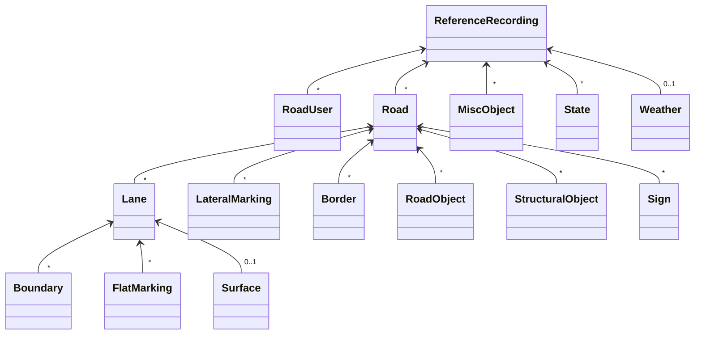
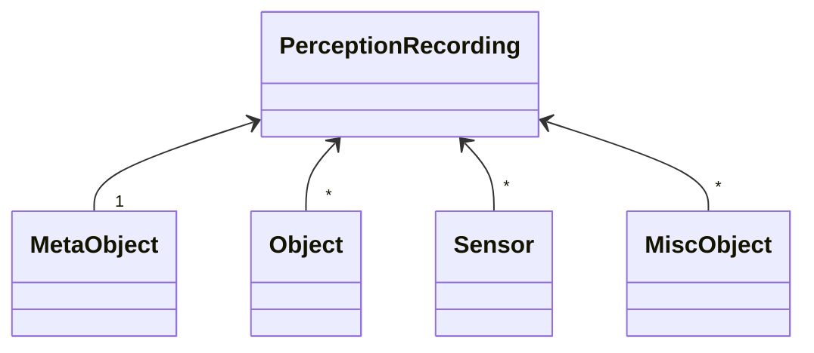

```mermaid
classDiagram
    ReferenceRecording <-- "*" RoadUser
    ReferenceRecording <-- "*" Road
    ReferenceRecording <-- "*" MiscObject
    ReferenceRecording <-- "*" State
    ReferenceRecording <-- "0..1" Weather

    Road <-- "*" Lane
    Road <-- "*" LateralMarking
    Road <-- "*" Border
    Road <-- "*" RoadObject
    Road <-- "*" StructuralObject
    Road <-- "*" Sign

    Lane <-- "*" Boundary
    Lane <-- "*" FlatMarking
    Lane <-- "0..1" Surface

```

```mermaid
classDiagram
    PerceptionRecording <-- "1" MetaObject
    PerceptionRecording <-- "*" Object
    PerceptionRecording <-- "*" Sensor
    PerceptionRecording <-- "*" MiscObject

```